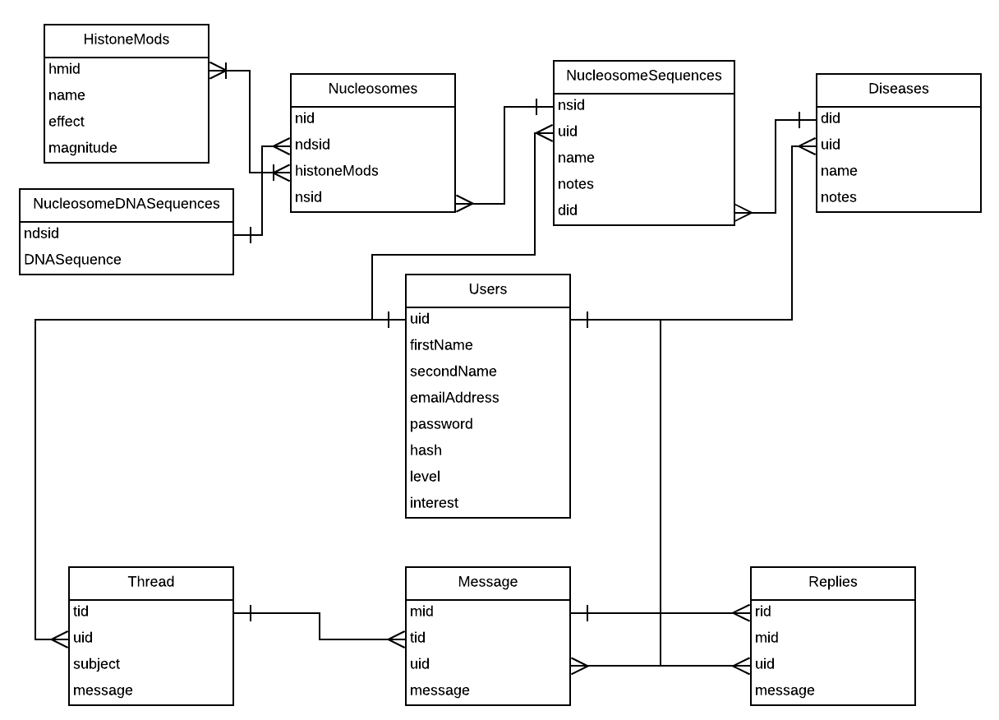

# Nomios - Analysis

## Definitions

In order for the reader to properly understand my solution, they must first understand the following definitions. Each definition is aimed at introducing the reader as if they have no knowledge of Biology so they may not be particularly specific. If they want more thorough definitions they should consult more specialised texts.

> A **protein** is a group of molecules that can have either a functional or structural role within an organism. THey are made up by a sequence of **amino acids**. The shape of a protein is dependant on the amino acids and their sequence.
>
> **Genetics** is the study of **genes**. These are molecules that code for proteins that make up an organism. The total sequence of genes in an organism is called the **genome** of the organism.
>
> **DNA** (or **Deoxyribose Nucleic Acid** to give its its full name) is the molecular structure that makes up genes. It is made up of a sequence of **nucleotides**, these are made up of a **base** (either **A**, **T**, **G**, **C**) and a backbone that binds to other nucleotides to create a **nucleotide sequence**. One nucleotide sequence is usually just a single gene, but may be an entire genome or anything inbetween. Each nucleotide's base has an opposite base (A with T and G with C) which is bound to another nucleotide. This means that DNA is double stranded. A single sequence therefore is measured in **base pairs** (bp).
>
> **Protein synthesis** is the production of proteins from DNA. It is performed through processes called **transcription** (the production of **mRNA** is a readable version of a specific sequence of DNA) and **translation** (this is where mRNA is read to produce a protein).
>
> **RNA Polymerase** is a protein that produces mRNA from DNA. It binds to a sequence of a DNA called the **promoter** which lies before the beginning of a gene.
>
> **Expression** is the volume of protein produced from one gene. It can vary.
>
> Each 127bp of DNA is wrapped around a **nucleosome**. This structure made of eight proteins that are arranged in a cubic shape (2x2x2). Each protein in a nucleosome is called a **histone**. The amino acids of a histone can be edited to change its shape and therefore change the shape of the overall nucleosome. These edits are called **histone modifications**. This is important for **transcription** as **RNA Polymerase** may find it easier or harder to bind to a region of DNA based on the overall shape of the nucleosome. This for RNA Polymerase ability to bind to a region of DNA is called **affinity**.
>
> * **Repression** is where histone modifications which change the affinity of a nulceosome to decrease, cause for the expression of a gene to decrease.
> * **Activation** is where the histone modifications which change the affinity of a nucleososome to increase, cause the expression of a gene to increase. 
>
> **Epigenetics** is the study of histone modifications and other effecs that change the expression of a gene.
>
> An organism's **epigenome** is its entire collection of epigenetic effects on its genome.
>
> A **histone modification sequence** is a set of histone modifications that work together to bring an overall effect on the expression of a gene.
>
> The **coding strand** is the sequence of bases that are replicated in mRNA during transcription. The opposite sequence of bases is called the template strand. As bases always pair with their opposites, the template strand is used to recreate the coding strand in mRNA form. A DNA sequence is represented as a string of letters (each letter representing a different base) with the base sequence being derived from the coding strand. 
>
> This is a key for purposes in database tables:
>
> | Key Symbol | Definition                                                   |
> | ---------- | ------------------------------------------------------------ |
> | **%**      | This will contain a unique ID for each record in the table. When a new record is added, the integer value will increment based off the value of the previous record. This is what makes each record's tid value unique. |
> | **$**      | This contains the unique ID of the user who created this post/started the thread. This is useful for retrieving information from the user, such as their first name that will be displayed to track messages to users in a thread. |
> | **¬**      | is is a string that contains the actual body of the original post in the thread. |

## The Problem

There are two major problems within the scientific and epigenetic communities today:

1. There is a limited amount of inter-disciplinary and international research within the scientific community. Research only takes place across the globe within major pharmaceutical organisations such as *Amgen* and *CERN* because only these large, multinational organisations have the resources to recruit scientists in the world and bring them into contact through common research. Even with *CERN* research is limited to one site in Switzerland, which means that scientists must commit to travelling frequently or emigrating entirely, which some scientists will not want to do, as they may not want to leave family and friend behind This limits the amount of collaboration between scientists, as they instead turn to local universities for research sites. This means that less of the brilliant minds of today can work together to research into some of today's most pressing questions. This is limited even more by the fact that scientists tend to stick to their particular field and therefore collaborate with scientists in their particular department at whatever university, meaning that less scientists work with others outside their field, which is necessary to delivering breakthroughs. For example, x-rays uses in medicine, when Wilhelm Rontgen, a physicist, discovered their detection of bone structures. It is that kind of daring to use a discovery in other fields that is key to finding new applications and discoveries, and this discovery is only accelerated by the collaboration of scientists in different fields as they have different expertise that could be used to create a new hypothesis and therefore, a new discovery. 														                           This will problem will be referred to in the rest of the text as **Problem A**.
2. There is currently no way to predict the effects of an naturally occurring histone modification sequence on the expression of a specific gene. This is a problem because it means that when researching an naturally occurring histone modification sequence, scientists must obtain an epigenetically altered DNA sequence (or re-create one) that is identical to the one they are trying to find the effect of, and then analyse its effects in the lab. This is because the combined effects histone modifications in a sequence are too confusing and takes too long to determine by hand, as there are many histone modifications in even a small DNA sequence. This is quite laborious and therefore takes a lot of time and funding to research the effect of a single histone modification sequence. This slows the rate of discoveries within the epigenetic field. What's more there is no widely accessible database which attributes histone modification sequences with causing specific diseases, which means that doctors cannot attribute someone's disease to an unhealthy epigenome. This prevents patients from getting treatment and therefore prolongs suffering.                                                                                                                                                                  This will problem will be referred to in the rest of the text as **Problem B**.

The groups that is affected by these problems are are all scientists (for problem A) and particularly **epigeneticists** (for problem B). Therefore my target audience consists of scientists for my solution to problem A and epigeneticists for my solution to problem B.

## The Solution Outline

**Nomios** is a solution to both of these problems.

It will consist of two parts:

1. A forum, which is an web page that users from all over the globe can access to discuss topics and answer questions.
2. A **histone modification interpreter** (or **HMI**). Which is a tool of my invention that can determine the overall effect of histone modifiction sequences of DNA sequences, particularly genes and return the resulting effect to the user.

### The Forum

#### How It Solves Problem A

Problem A partially exists because of the fact that some scientists are unwilling to leave their homes behind in pursuit of collaboration. By creating an tool where users can talk on the internet from all across the globe, scientists can now communicate and become involved in collaborative efforts whilst remianing at their homes. This means that each scientists can use their own lab and their own team on a very specific task as part of a larger peice of research conducted by an online group of which they would be a part of.

This group would use the forum to create a thread specific to their peice of research that would include responses that include new data on a particular task or how much progress into the research being conducted was made in a particular week.

A forum would also remove the need for a large multinational organisition to be neccessary for international research. This is because scientists would be able to come into contact with each other from across the globe through communicating on the forum rather than through common research forced onto them by an organisation. This means that after becoming accquainted with each other, scientists may collaborate and begin their own research. This in itself is a benefit as it means that research is not neccisserily dictated by profit, and therefore more beneficial to the scientific community.

Problem A also includes the fact that there is little interdiciplinary research within the scientific community. By creating a forum that is open to scientists from all disciplines, they can come into contact with each other. This increases the liklihood of collaboration occuring between scientists of different disciplines and therefore, interdisciplinary research.

#### Technical Overview

The forum will be made up of two elements:

* A database (the backend) to contain each thread and its associated responses.
* A user interface (the frontend) with which the user can read threads, respond to them and create new ones. All of these actions will submitting data to the database, which means that their must be some interface between the backend the frontend. This user interface is discussed later in the document.

The database will be using MySQL. Therefore, it will use SQL syntax to perform CRUD (Create, Retrive, Update, Delete) actions on the database.

The database will be made up different tables, each table containing multiple attributes which describes a particular object. I will describe each table briefly below:

**Thread Table**

This table is used to store the original post in a thread. It uses the `tid` attribute to link responses to this original post to create an overall thread.

| Name     | Purpose                                                      |
| -------- | ------------------------------------------------------------ |
| tid      | %                                                            |
| uid      | $                                                            |
| subject  | This is a string that contains a summary of what the thread is about. |
| message  | ¬                                                            |
| dateTime | This contains the time and date when the thread was posted.  |

**Messages Table**

This table is used to store a response to the original post. It links to a particular thread using the `tid` attribute.

| Name     | Purpose                                                      |
| -------- | ------------------------------------------------------------ |
| mid      | %                                                            |
| uid      | $                                                            |
| tid      | This contains the ID for a particular thread.                |
| message  | ¬                                                            |
| dateTime | This contains the time and date when the message was posted. |

**Replies Table**

This table holds all of the responses to a particular message within a thread.

| Name     | Purpose                                                      |
| -------- | ------------------------------------------------------------ |
| rid      | %                                                            |
| uid      | $                                                            |
| mid      | This contains the ID value of the message that is being responded to. |
| message  | ¬                                                            |
| dateTime | This contains the time and date when the reply was posted.   |

------

These tables have relationships between each other to build up an entire thread and may consist of one original post, multiple messages and multiple replies attached to each of those messages.

Note that the `Replies` table does not need to contain a `tid` attribute, as the ID of the thread that the reply belongs to can be inferred via the value of the `tid` attribute in the message that the reply is related to.

------

There is one more element to this solution that should be added. Henry is a physics student who has an interest in the scienetific forum as a result. He suggested to me (Article 2.1) that the forum should include "formatting techniques".

Formatting techniques are methods are change the presentation of text. This can let the user "display information succinctly" (if the user creates a list of say, resources neccessary for an experiement) and "emphasize" certain key points in a short essay about say, methane. Overall, users can communicate much more effictively using text formatting, as they can convey what they mean more reliably. 

They also may make communication more efficient as it reduces confusion between users, so less communication has to take place to convey an idea or point.

As Henry is part of my target audience, he knows what end users will want. So in order to make sure that my solution satisfies the problems that this audience suffers, I should include formatting techniques in my final solution.

#### How It Solves Problem B

Problem B is based of the fact that the only way to determine the final effect of a known histone modification sequence is through using lab techniques. This is because even a short DNA sequence can contain many histone modifications, making the effect of a sequence difficult to determine. However, the effect of each histone modification on its own is known.

Using these facts, I can determine the overall effect of a sequence by taking into account each histone modification's effect as discrete integer values, and then find the sum of these values. This will therefore involve a simple mathematical formula:
$$
\sum^n_1 \ m*f
$$
Where:

* *n* is the number of histone modifications.
* *m* is the magnitude of the effect of the current histone modification in the form of an integer. This represents how influential a histone modification is on the expression of a gene.
* *f* is the type of effect of the current histone modification, and can either have a value of 1 or -1, for histone modifications that cause activation and repression ones respectively.

This formula finds the sum of the all histone modifications' magnitude multiplied by their effect. This therefore finds a discrete value for the change in expression of a gene using discrete values for effect and magnitude. Because of the values of f, an overall repressive effect will have a negative value and an activational one will be positive. The magnitude of the sum will indicate how large a the change in effect is.

From this formula, we can predict what the effect of a given histone modification sequence will be. This solves problem B.

However, in order to find out what the effect and magnitude values of each histone modification are, we will have to consult a table that contains these. This is partly the reason why we will have a database for this histone modification interpreter.

The other reaons for having a database include:

* To store the histone modification sequences that are created by users.
* To store the DNA sequences that are being affected by these histone modification sequences, so that the gene/s or DNA sequences that are being affected can be identified.
* To store important information in the form with each histone modification sequence that may be useful to readers.
* To attribute specific histone modification sequences to particular diseases, such as increases in the rate progression of Alzeimer's Disease due to activational histone modifications on the *APP* gene (which is a protein that is linked to the cause of Alzeimer's Disease).

The tables include within the database are as follows:

**NucleosomeDNASequences Table**

This table holds the DNA that may surround a single nucleosome. It should be stored as there may be multiple different histone modification sequences for one DNA sequence, such as a gene. Therefore, the same nucleosome DNA sequences will be used. This will save storage in the database.

| Name        | Purpose                                                      |
| ----------- | ------------------------------------------------------------ |
| ndsid       | %                                                            |
| DNASequence | This is a string that contains the 127 bases of DNA that surrounds a nucleosome. |

**HistoneMods Table**

This table will contain all of the known histone modifications.

| Name      | Purpose                                                      |
| --------- | ------------------------------------------------------------ |
| hmid      | %                                                            |
| name      | This is a unique string that identifies the histone modification, so that the user can differentiate one histone modification from another. |
| effect    | This represents the type of effect the histone modification has. |
| magnitude | This represents the amount of influence the histone modification has on the expression of a gene. |

**Nucleosomes Table**

This table will contain all of the individual nucleosomes produced by the users.

| Name        | Purpose                                                      |
| ----------- | ------------------------------------------------------------ |
| nid         | %                                                            |
| ndsid       | This contains the value of the DNA sequence that the nucleosome contains. |
| histoneMods | This contains a list of IDs of histone modifications that this nucleosome contains. Each mod is differentiated from another by a comma. |
| nsid        | This contains an ID value that represents the histone modification sequence that this nucleosome is part of. |

**NucleosomeSequencesTable**

This table contains the overall information for a particular sequence, such as its name and important information concerning the sequence.

| Name  | Purpose                                                      |
| ----- | ------------------------------------------------------------ |
| nsid  | %                                                            |
| uid   | This contains the ID value of the user who created the sequence. This will be used to make sure that only this user can edit it and be credited for it. |
| name  | This contains a unique name relative to the user, as different scientists may submit discoveries about the same DNA sequence and histone modification sequence simultaneously. |
| notes | This contains important information about the sequence.      |
| did   | This may contain the ID value of the disease that the sequence that it is associated with. |

**Diseases Table**

This table will contain overall information about a particular disease that different histone modification sequences may be attributed to. This could be because different histone modifications sequences alter the same gene, or that different histone modification sequences alter different genes which contributes to the overall disease. Note that "Diseases" is only an arbitrary name as the records of this table could be used to group nucleosome sequences based on other pieces of information, such as whether or not the sequence increases cancer risks.

| Name  | Purpose                                                      |
| ----- | ------------------------------------------------------------ |
| did   | %                                                            |
| uid   | This contains the ID value of the user who created the disease. This will be used to make sure that only this user can edit it and be credited for it. |
| name  | This contains a unique name, so that the disease can be differentiated from others. |
| notes | This contains important information about the disease, such as its symptoms and other non-epigenetic causes. |

------

These tables have a relationship. This allows for multiple nucleosomes to be strung together to form a nucleosome sequence, multiple nucleosome sequences to be associated with a single disease and multiple histone modifications to be a part of a single nucleosome.

It is important to notes that the `Nucleosomes` table has a many-to-many relationship with the `HistoneMods` table. This is because many different nucleosomes may contain the same histone modification and one nucleosome may contain many different histone modifications.

It is also important to note that their is a structural hierarchy here, with the Diseases table at the top, containing all nucleosome sequences, which contains all nucleosomes, which contains all nucleosome DNA sequences an histone modifications. This lets us build up a large overall picture of say a disease, and break it down into further and further chunks, first by looking at the combinative effects of multiple nucleosome sequences, then the effect of each nucleosome sequence by itself, then the modifications on each nucleosome and the DNA sequence that they effect. Although note that nucleosome sequences do not have to be associated to a disease and therefore, may be at the top of their own hierarchy.

This allows doctors to read detailed information on specific diseases, the histone modifications that help cause them and the DNA that these modifications influence. This therefore helps solve Problem B as doctors can read into the symptoms of a disease and the specific causes,w which helps them determine whether or not a patient has a particular disease. This helps to solve problem B.

#### Elements That Affect Both Solutions

The **users** table holds a unique record (called an **account**) for each individual who uses *Nomios* and is what allows for specific nucleosome sequences, diseases, threads, messages and replies to be attributed to an individual. This allows for SQL queries which can check if a user owns say, a particular nucleosome sequence, so that we can let only the user who owns the nucleosome sequence to edit it.

| Name         | Purpose                                                      |
| ------------ | ------------------------------------------------------------ |
| uid          | %                                                            |
| firstName    | This contains the first name of the individual who owns this account. |
| secondName   | This contains the second name of the individual who owns this account. |
| emailAddress | This contains a unique email address that the individual owns. This will be used to confirm the account's validity via email to prevent bots from spamming the database. |
| password     | This contains a password that has been encrypted (cannot be read by humans) using a hashing algorithm. This prevents malicious users who can see the database from extracting passwords. Once encrypted the password cannot be decrypted, as hashing works only in one direction, making the password more secure. In order to check if an inputted password/emailAddress combination is correct, the inputted password will be hashed using the same algorithm and compared with he stored one. |
| hash         | Contains a hashed password value using a different hashing algorithm to enhance security. This is set to NULL once the account has been activated. |
| level        | A value of 0 represents a standard account, 1 represents an admin account. |
| interest     | This contains a string value that holds basic information as to why the user registered an account. this could be sold to large scientific websites. |

The *users* table also connects both solutions' entity relationship diagrams. This is because the *users* table has relationships with both diagrams. this is powerful because it lets a single user use one account for both solutions. This is will lower the amount of storage required for a database and creates a smoother user experience. This therefore solves both problems for a user, such as an epigeneticist.

**User Interface**

The user interface (UI) is important as it is through this that the user uses my solutions. Therefore, in order to cater the needs of my target audience I decided to discuss what the user interface should be, and how it should look directly with them. This would ensure that my solution would be accessible to my target audience.

Note that the aim of a good UI is a good user experience. This means that the solution is not unpleasant to look at, all actions perform as expected, easy to navigate and they can find the information they need quickly and effortlessly. It must also be responsive so that it can be used on multiple devices.

------

Henry is a physics student, and therefore intrested in a scientific forum. He discusses in writing what he thinks the UI should be and look like (Article 2.1). These design cues should also apply to the HMI as both solutions are inside the same web application. This means users only have to become familar with one UI instead of two.

He first writes that from a design perspective the UI should be "clean and minimalist". "Clean" means that the user interface should look bright, vibrant and not too crowded with multiple design elements. This is beneficial as it makes sure that the website is a pleasure to look at and therefore creates a better user experience. Therefore I will need to design a clean UI.

The word "minimalist" means that no unncessary information should be displayed. This makes sure that the user is not overwhelmed with information and can find the information that they are looking for quickly without having to use a search tool within the browers (such as Google Crome's Find tool). This increases the usability of the forum, as the user is not prevented from finding the information they are looking for. This creates a better user experience. Therefore I will design a minimalist UI.

Henry also states that whilst mataining these qualities the UI should also be "very functional when required". This means that the UI should let an action be possible when the user is going to use it. For example, the user should be only able to post threads when they are in the looking at a page that lists all threads, and not when they are reading a specific thread. This also helps the user expect different actions when in different sections of the UI, so they know where to go in the UI to perform a particular action. This therefore means that the UI is easy to navigate. This creates a better user experience. When designing the UI I will ensure that each action only appears in one section (to make the UI easy to navigate).

To make sure that actions perform as expected the UI will have be designed so that either a successful result is returned after an action or an error that the **user** can fix is returned. Therefore it is important to catch any logical errors before they occur so that logical errors at runtime are not displayed, such as a lack of an input value. These errors can then be displayed to the user in the form of a user-friendly message. I will implement this in my UI.

Finally, the UI must be responsive to different devices. This is to give as many users as possible access to *Nomios*. To do this I will use a specific feature of a technology called **CSS** called **media queries**. These can change the style of a UI depending on the size of the screen of the device used. 

#### Use Cases

In order to explain how my solutions work, I thought I would explain use cases for my solution. The forum is self-explanatory, so these use cases only apply to the HMI.

1. A doctor wishes to diagnose a patient with a highly aggressive form of Alzheimer's Disease. In order to perform this diagnosis there must be evidience of this disease. This form of Alzheimer's Disease has activational histone modifications at the gene that codes for the APP gene. The doctor will first find out what the sequence of histone modifications are in the epigenome of the patient. They then sign into *Nomios* and search the database for any sequences attributed to Alzheimer's Disease. They discover that a user has already submitted a histone modification sequence at the APP gene that creates the symptom of highly aggressive Alzheimer's Disease. They compare the patient's histone modification sequence with that on *Nomios* and discover that they match. The doctor can now diagnose the patient with this particular highly aggressive form of Alzhiemer's Disease.
2. A researcher in epigenetics wishes to discover what the overall change in expression is for a particular gene. that has a lot of repressive histone modifications and a few activational histone modifications for its histone modification sequence. They sign in to *Nomios* search the database to see if any one has already submitted this histone modification sequence. Unfortunately nobody has. They then submit their histone modification sequence with the DNA of the gene to their database. After navigating to the sequence they have created, they discover that the overall change in expression for this gene is -26. This indicates a large decrease in the expression fo the gene. This took 5 minutes to do wheras in a lab it would take weeks if not months. This sequence can then be seen by other users, including other researchers or doctors.

### Technologies

There are some key technologies neccessary for this solution to work:

* **PHP** is a programming language that can handle database requests to the server and handles the responses by that server and processes those requests. It is responsible for inputting and outputting data from the database. It interfaces well with MySQL which is one reason why it was chosen. It also has a wide community in case I have any program with the language.
* **HTML** is a way of formatting text so that it can be interpreted by browesers to display a web page. The formatted text can split into parts called elements.
* **CSS** is a way of stylising the elements of HTML. It will be used to partly create the UI.
* **JavaScript** is a programming language that can create UI mechnisms (such as eroor prevention with inputs by deleting invalid characters) that CSS cannot. It can also be used to change the styles of specific elements and add content to those elements, after the page has loaded. It lets us manipulate **cookies** whihc are small text files associated with a aparticualr website stored locally on a computer. PHP lets us do this too, but JavaScript's methods are more reliable.
* **MySQL** is a database design language (DDL) which is used to both create databases and perform CRUD functions on those databases. It interfaces well with PHP which was one reason as to why it was chosen over other DDLs. CRUD is a set of basic functions that are used on a database, known:
  * Create - creates a new record in a table in the database.
  * Retrive - extracts a record froma table in the database.
  * Update - changes the data in a row in a table in a database.
  * Delete - Removes a row from a table in a database.

## Research

I did carry out research into problem A and B to make sure that they were genuine problems and therefore, that my solutions are valid:

* Article 1.1 suggests that it is difficult to understand a sequence of histone modifications. "this is a code that is extraordinarily difficult to read". Here "code" refers to a sequence of histone modifications. By "difficult to read" the text is implying that a histone modification sequence is difficult to understand. Therefore, its overall effect on the expression of a gene is difficult to find out, as it is difficult to take into account each histone modification. Therefore, a solution is needed to let epigeneticists read a histone modification sequence.
* Article 1.2 suggests that a method for reading a histone modification sequence successfully has not yet been found ("not yet possble"). Here a histone modification sequence is called a "complex combination [of histone modifications]".

When it came to deciding what elements my HMI solution should contain, I spoke to a potential user: Luke. He is a Biology student at my school and may use the HMI to learn more about Epigenetics. He wrote a peice of writing to indicate what he thinks would be useful in the HMI, as outlined in Article 3.1. Here I shall discuss what he wrote and how I can incorperate this into my solution to meet my users' needs:

* He first states that because histone modficiation sequences are very "complciated" they should be simplifed by being "broken down". This he says is very key to letter users understand a sequence more easily ("makes a sequence easier to understand"). Not only this but "edits" will be easier, because specific nucleosomes can be displayed so a user can specify particular bases or histone modficiations to change, add or remove. I can incorperate this into my solution displaying a histone modification sequence one-by-one and letting the user edit a particular nucleosome when they are editing a hisotne modification sequence.
* He also writes that the entire DNA sequence should be displayed to the user. This is because DNA sequences are used in "other applications". By "applications" he includes creating "artificial DNA" which is useful in genetic engineering. Scientists might want to do this using HMI over another form of base sequence storage because it has histone modification sequences attatched to it, which they might also choose to use in other applications. I will implementn this by displaying the entire DNA sequence when a user is viewing a particular sequence.
* He suggests that HMI will be "difficult" to use. This is due to the software being "unqiue". He is suggesting that the application software is specialist and therefore, not natural to use by the "[UI is] very different" to other peices of software, such as Facebook. Therefore it should contain a "guide". I took this to mean a help menu. I will implement this by creating an entire webpage that the user can read that will contain a complete guide as to how to use the software.
* Finally he discusses the idea of "searching" for a particular histone modification sequence. This is because the database will be "very large" and therefore difficult to locate a specific histone modification sequence, which is what scientists need to do when researching a particular gene or effect on that particular gene's expression, such as the *APP* gene's increased expression in Alzheimer's Disease. I will therefore implement a search tool in my solution so that users can find a histone modification sequence by name. Taking this a step further, I can apply this to my forum and to diseases so that users can find a thread that they are contributing to and so that scientsist scan quickly locate all histone modficiations associated with the disease they are researching into.

## Objectives

In order for my solutions to have solved problem A and B , each of these objectives should be met:

1. The user should be able to start threads in the forum so that they can ask questions, further their knowledge and collaborate with other scientists.
2. The user should be able to respond to threads and messages within threads so that communication can take place between users.
3. The user should not be able to remove any messages that they have posted or threads that they have started. This is to make sure that other users can still access old questions so that they can learn from them too.
4. The user should be able to process a sequence of histone modifications on a particular gene **and** recieve a result that lets them know what the change in expression will be. This is fundemental to the solution as it lets users predict how mucha  gene is expressed without conducting expensive lab work.
5. The user should be able to edit a DNA sequence so that they can (for example) amend any errors produced and change the current allele to another allele. They should be able to change the sequence of histones to change the resultant expression of the gene.
6. The user should be able to describe what a particular sequence does and be able to name a sequence so that they can differentiate sequences from each other.
7. The user should be able to view groups of sequences that attribute to a particular disease so that they can collaborate with other scientists on research for a particular disease.
8. The user should be able to search for other sequences, sequences within diseases and threads including their own so that they can benefit from other users' data and navigate to their own for their own research.
9. The user should have their own account so that the data that they have submitted can be attributed to them. Similarly, they should not be able to submit new data without being signed into an account to ensure that new data is attributed to their account.
10. There should be a "help" menu that the user can navigate to so that they can learn to use the website quickly and easily.
11. Users should be able to style their forum posts using some form of mark up. This will enhance communication between users as it structures texts so that communication can be more effective and efficient.
12. HTML should not be a valid form of text when submitting posts to forums or creating notes and names for particular sequences and diseases. This is to prevent malicious attacks on the website that may distort its intended display.
13. An admin should be available in the forum that can delete inappropriate threads, messages or replies. This is to ensure that the forum remains a friendly place to communicate so that users maintain communication and collboration.
14. The result displayed once a histone sequence is interpreted (i.e. the change in expression of a gene) should be accurate to what is observed in real life.
15. The website must be viewable on a mobile and desktop device so that it can be accessed by a user no matter their device preference.

There are 15 objectivies, which makes my project fairly large in scope, particularly as the overall project is made up of two distinct solutions.

## Critical Path

The critical path outlines the steps I need to take in order to complete my solutions. Each step fufills a specific objective until the project has been completed. Note that at each "test" point within a step constists of testing what was created in the current step and fixing any errors that are found.

1. The entire database should be created, containing both the tables for the HMI and the forum, as well as the *users* table. Some test records are entered. This is done so that code written after can be immediately tested.
2. Create the UI elements in CSS and HTML. This is so that we can quickly use elements we defined earlier when we are actually designing the UI.
3. Create the sign up, sign in and sign out user interfaces. This is so that we can write the scripts without having to imagine how the outputs and inputs will look like in the final product - we can just test it right away.
4. Create the sign up, sign in and sign out PHP and JavaScript scripts and test.
5. Create the user interface for the main page of the forum (where all threads will be displayed) and the UI for posting a new thread.
6. Create the PHP scripts that retrive and display all of the threads in the forum from the database and for submitting a new thread and the JavaScript scripts for error prevention and test.
7. Create the user interface for displaying a single thread's original post and all of its associated responses. Including the UI for posting a new message or reply.
8. Create the scripts neccessary to retrive and display the thread's original post and its responses from the database and test.
9. Create formatting techniques for the forum. This will be done in PHP. When PHP retrives text that includes formatting, this text will be converted to HTML amarkup so that is can be viewed by the browser. Test.
10. Implement admin privilages to the forum, such as deleting specific threads, messages and replies. Test
11. Create the UI for creating a new histone modification sequence.
12. Create the PHP and JavaScript scripts for submitting a new histone modification sequence to the database and for error prevention and test.
13. Create the UI for the search page that allow for searching through the forum and the HMI database.
14. Create the PHP script that lets the user search through the forum and HMI database to find specific threads and sequences respectively, then test.
15. Create the UI for displaying the results returned by the search. Each result should redirect the user to a page displaying only that result in detail (such as a thread page, disease page or histone modification sequence page). This last part will use JavaScript.
16. Create the PHP script that retrives results from the database and displays them in the search result UI.
17. Create the UI for displaying one histone modification sequence sequence in detail (nucleosome by nucleosome). This will also contain the UI for editing this hisitone modification sequence, but this will only display when the current user is the one who owns the histone modficiation sequence. This will be made using CSS and PHP.
18. Create the PHP script for retriving from the database displaying the histone modfication sequence. Test.
19. Create the UI for displaying a single disease and all associated histone mdofication sequences. This will also display the UI for editing the details of the disease, such as the name and important notes. This UI will only be displayed if the current user is the one who owns the histone modficiation sequence. This will be made using CSS and PHP.
20. Create the PHP script for retriving from the database displaying the disease and associated histone mdofication sequences. Test.
21. Test that the UI is responsive to different screen dimensions for different devices. Make any fixes that are neccessary.
22. Perform a final test on all elements on the *Nomios* and perform any fixes neccessary so that there are no issues that have arisen from the code being altered as elements of the solution are added to this code.

## Appendicies

Here is my list of texts that I have refered to throughout this document, and their sources.

#### Article 1.1

**Source:** *The Epigenetic Revolution* by Nessa Carey.

> The pattern of modifications is referred to as a histone code. This problem that epigeneticists face is that this is a code that extraordinarily difficult to read.

#### Article 1.2

**Source:** *The Epigenetic Revolution* by Nessa Carey.

> ... it's not yet possible to make accurate predictions from complex combinations.

------

#### Article 2.1

**Source:** Henry - a Physics student.

> What I'd expect from a scientific forum purely in terms of design would be for the interface to be clean and minimalist but also very functional when required. Often when discussing complex topics the need for useful formatting techniques such as emboldening specific text in order to emphasize points and that I can use simple lists in order to display information succinctly.

#### Article 3.1

**Source**: Luke - a Biology student.

> A histone modification sequence can be very complicated. To simplify it, I would like it to be broken down into nucleosomes before it is displayed. This makes a sequence easier to understand and lets edits be more specific to particular nucleosomes. 
>
> Sometimes researchers needs to access an entire DNA sequence for other applications, such as producing artificial DNA. The DNA sequence that is used by a particular histone modification sequence should be displayed in full for a particular histone modification sequence.
>
> This tool will probably be difficult to use. This is because it is very unqiue and therefore it will be confusing to first use as it will look very different to anything else. THe user shoudl have some form of a guide.
>
> The database will be very large and I am often looking for a specific histone modification sequences. I think that I would want to be able to search for a sequence by name so that I can retrive data from it quickly.