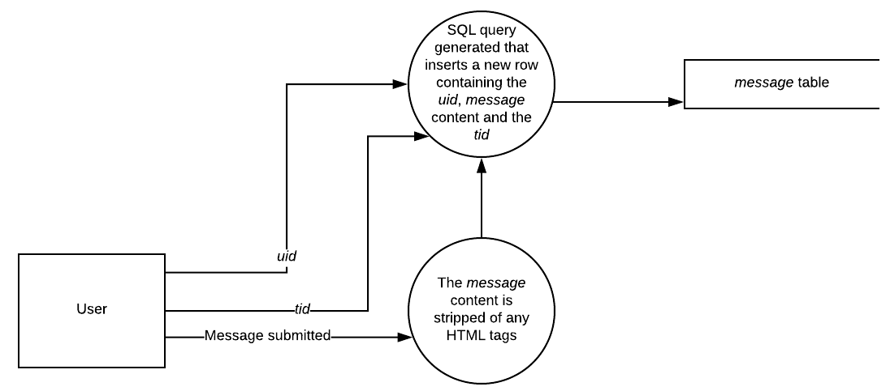
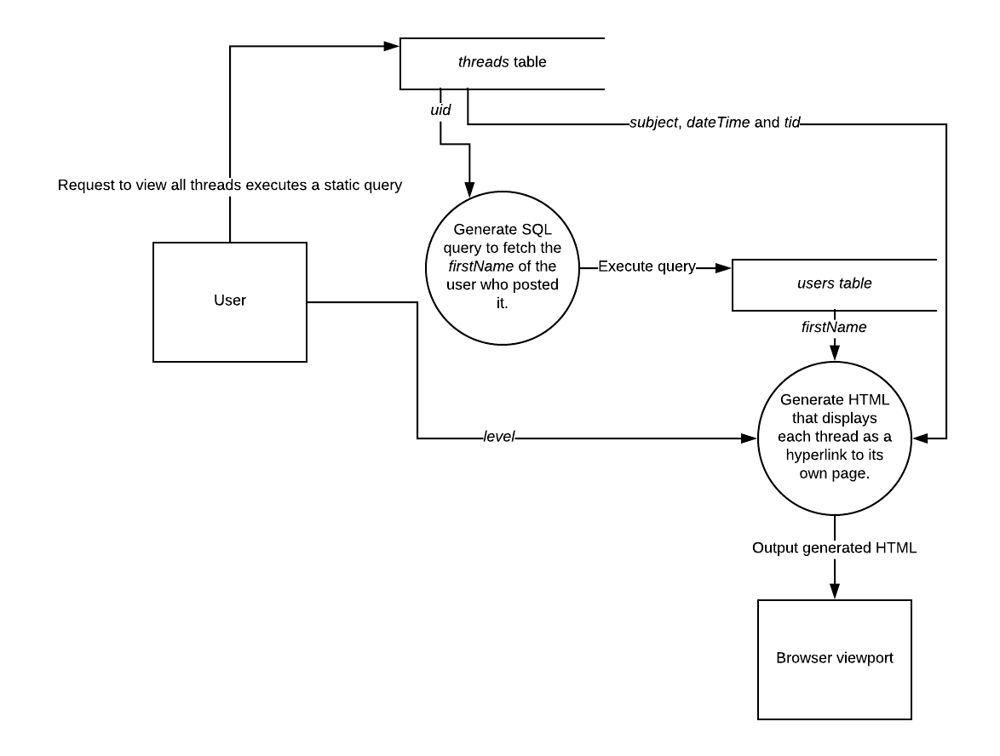

# Nomios - Documented Design

## Introduction

In this document I shall outline key components of my solution, and explain how they work. I will also outline how individual components of my solution work to form a whole in my *High Level Overview*.

## Definitions

Below are some of the necessary terminology and their definitions for this document. Any other bits of terminology used are defined in the *Analysis* document.

> **Data Flow Diagrams** (**DFD**) shows how data is processed by a program, where it is stored as well of what is outputted and what data is inputted into the program.
>
> A **class** is a template for the **properties** (attributes) and **methods** (functions) of a particular object.
>
> A **Class Diagram** shows the structure and function of a class. It is split up into three sections. The top section displays the name of the class. The middle displays the properties of the class. The bottom section displays the methods of the class. The follow table is a key for the symbols used in a class diagram:
>
> | Key  | Definition                               |
> | ---- | ---------------------------------------- |
> | +    | A public property/method.                |
> | -    | A private property/method.               |
> | :    | The string before this symbol is the name of the property/value. The string after is data type of the property or the data type of the data returned of the method. If there is no second type than the method is **void**. This means that is returns no data. |
> | =    | The string after this symbol is the default value of the property. |
>
> A **cookie** is a small text file that is stored locally on a computer that is associated with a particular website.
>
> **XSS** attacks are a type of malicious attack that allows malicious users to inject client-side scripts into a web page. For example, by inserting HTML code into a database table that is later read.
>
> A **thread** is a sequence of posts on a given topic, chosen by the first post in a thread. This first psot in known as the **original post**.
>
> A **message** is a response to a thread's original post.
>
> A **reply** is a response to a message within a thread.
>
> The **uid** is the unique ID of an account and will be stored in a cookie.
>
> A **static query** is a SQL query that does not use any variables and therefore does not change.
>
> The **browser viewport** is where a webpage is displayed within the browser.
>
> The **level** of a user indicates the type of account that user has. It should be stored in a cookie.
>
> A **sequence** is a nucleosome sequence that contains a DNA sequence and histone modification sequence for each histone.
>
> A **table** is a data structure within a database that contains data about an object.
>
> An **attribute** is a data type for a particular property of the object a table is trying to describe.
>
> A **record** is a single data entry in a table. It contains values for each attribute in the table. This is also known as a **row**.
>
> A **column** is a set of values for one attribute - one value for each record. These values are of the same type as they are from the same attribute.
>
> **Overall Data** describes information that names or gives a description for a particular sequence or disease. This description should aim to give an overview of the information concerning this sequence or disease. 
>
> A **HTML form** is a HTML element that contains inputs that submit data via either the POST or GET protocols. Inputs within the same form cannot have different protocols. The situations in which the POST and GET protocols should be used are outlined below:
>
> | Protocol Name | When It Should Be Used                                       |
> | ------------- | ------------------------------------------------------------ |
> | POST          | This is used for data that is very large (such as a long string) or sensitive data (such as a password). This is because POST can submit data that is much larger and is not stored in the URL so it cannot be viewed by the user. |
> | GET           | This is used for data that is short (such as an ID for a forum post) or insensitive data (such as a username). This is because GET submits data via the URL which means that data should be shorter so that the URL is still fully visible and because the URL is visible it lets malicious users look at data directly through the URL, so sensitive data should not be submitted through GET. |
>
> This is a key for purposes of attributes in database tables:
>
> | Key Symbol | Definition                               |
> | ---------- | ---------------------------------------- |
> | **%**      | This will contain a unique ID for each record in the table. When a new record is added, the integer value will increment based off the value of the previous record. This is what makes each record's tid value unique. |
> | **$**      | This contains the unique ID of the user who created this post/started the thread. This is useful for retrieving information from the user, such as their first name that will be displayed to track messages to users in a thread. |
> | **¬**      | is is a string that contains the actual body of the original post in the thread. |
>
> This is a table of definitions for the types of attributes in database tables: 
>
> | Type               | Definition                                                   |
> | ------------------ | ------------------------------------------------------------ |
> | **VARCHAR *x***    | A string with a variable length in characters up to a maximum of *x*. This means that the length of the string is always equal the length of the text in characters up to a maximum. This saves storage. |
> | **CHAR *x***       | A string with a fixed length of *x* characters.              |
> | **UNSIGNED INT**   | An unsigned integer value. This means that all values are positive, increasing the range of positive values that can be represented. |
> | **BIT**            | A single bit. Can have a value of either 1 or 0.             |
> | **AUTO_INCREMENT** | Precedes an INT type. This causes the value of the attribute for a record to be one greater than the previous record's. |
> | **PRIMARY_KEY**    | This defines an attribute to be the primary key of a table. The value of this attribute for this record is unique so that a specific record may be retrieved quickly and simply. |
> | **FLOAT**          | A decimal value using a floating decimal point. This increases the range of values that can be contained. |
> | **NULL**           | Specifies that the value of this attribute for a record may be null (meaning that it contains no value). If not specified, assume the attribute is has the NOT NULL type (this means that the attribute for a row must have a value). |
>
> 

## High Level Overview

I have decided to model both of my solutions using a data flow diagram. This is because my solutions use a lot of data (for example, long DNA sequences) and the way this data is stored and retrieved and the processes for both of those is very complicated. A DFD can show these processes more simply and therefore make it easier to implement.

These DFDs use the **Yourdon and Coad** notation. This is because I find this notation to be the most clear and therefore, useful to me when implementing my solutions. In this notation, **processes** (such as algorithms) are represented by circles, external entities (input and output mechanisms) are represented with **shorter rectangles** and data stores (such as a table in database) are represented with **longer rectangles with the left edge missing**.

The complexity of a DFD can be represented in levels, with level 0 being the simplest, single process DFD and level 3 and beyond being incredibly complicated that only programmers can understand it. To make sure this document is readable by a large audience whilst still being useful during my solutions' development the complexity of my DFD diagrams will be level 2.

A **physical DFD** shows how a program should be actually implemented. A **logical DFD** is used in a business context and is therefore not relevant to this project. Because of this and so that the DFDs are relevant for later use my DFDs will be physical.

Each DFD makes references to the database. This was outlined in my *Analysis*, but will be explained in further detail in this document. Either can be consulted when reading these DFDs.

this high level overview is meant to give an abstracted idea of how the solutions work. For a more in detailed explanation of each component of the solution please consult *Technical Components* section of this document.

### Forum

As an overall forum DFD would be very complicated and difficult to understand I have broken up the DFD into five different diagrams. Note that external entities should have an output and input but my diagrams do not show this. This is because when linked together all external entities show this characteristic but when broken down this is not the case.

#### Starting A Thread


When a user wishes to start a new thread they submit a subject and body for their post  (called the *subject* and *message* respectively), the contents of the *subject* and *message* are run through an algorithm that removes any HTML tags. This is to prevent XSS by a malicious user, as the client-side code (such as JavaScript which is inside HTML tags) is removed before being inserted to the database.

The stripped contents of the *subject* and *message* is then passed to another algorithm along with the *uid* which produces a SQL query that inserts a new row into the *threads* table. This is query therefore submits the *subject* and *message* contents to the table so that it can be stored when executed. The uid is stored so that the thread can be related to the user so that information such as the user's first name can be displayed with the post.

#### Posting A Message



When a user wishes to post a message, they input the body of the response (also called the *message*). The contents of this is the run through an algorithm that removes any HTML tags to prevent XSS attacks just like when posting a thread. 

The ID of the thread (called the *tid*) is fetched from the URL of the user's current page. The *uid* is fetched too. These are used with the stripped content of the *message* to generate a SQL query which inserts a new row into the *message* table when executed.  The uid is stored so that the message can be related to the user so that information such as the user's first name can be displayed with the post.

#### Posting A Reply


When a user wants to post a *reply* they must first input the body of text that they wish to respond with. This is called the *message*. The contents of this is the run through an algorithm that removes any HTML tags to prevent XSS attacks just like when posting a thread.

The unique ID of the message (called the *mid*) that is being responded to is fetched. This along with the *uid* and stripped contents of the *message* is processed by an algorithm to produce a new SQL query that will insert a new row into the *replies* table. This lets the data be stored so that it can be retrieved later.

#### Viewing All Threads



When a user request to view all threads a links to their own pages, a static query is executed on the *threads* table. This fetches the *subject*, the *dateTime* (the date an time at which the thread was started) the *uid* of the user who started the thread and the unique ID of the thread itself (the *tid*). It is ordered in chronological order using the *dateTime* attribute.

The *uid* of the user who started the thread in inputted into an algorithm which generates a SQL query. This query will retrieve the *firstName* attribute of the user who started the thread. This data, along with the *subject*, *dateTime* and *tid* is used to generate HTML that displays each thread as a hyperlink, with the *subject* being displayed to the user so that they know what the topic of the thread is, the *dateTime* so that they know how relevant the thread is to the current date and time, and the *firstName* of the user who posted it so that they relate two threads to the same user (this is useful for understanding the scientific expertise of the user for recruiting reasons).

Note that the URL for this hyperlink will contain the *tid* so that the page redirected to can use it to display that thread. This use of the *tid* is shown in the DFD below.

#### Viewing A Single Thread


When the user wishes to view a thread on its own page (so that they can read the entire thread), they will have clicked on a hyperlink produced by the *Viewing All Threads* DFD. This hyperlink will contain the *tid* of the thread that the user wishes to view. This *tid* is used in two algorithms:

* To generate an SQL query that retrieves the original post of the thread. When executed, this SQL query fetches the *subject*, *message* and *dateTime* attributes (the subject, body and date & time of posting respectively) of the original post. The *uid* of the user who started this thread is also retrieved.

* To generate a SQL query that retrieves the *message*, *mid* and *dateTime* attributes of each message that is associated with the original post. The *uid* of the user who posted this message is also retrieved. This *mid* is the unique ID of the message.

  After this, each message's *mid* attribute is used to generate a SQL query that retrieves data from all of the *replies* associated with each message. This data includes the *message* attribute, the *dateTime* attribute and the *uid* of the user who posted this reply.

Note that each post's *dateTime* attribute is used to order the posts based on when they were posted. This will be explained further later in the document.

The *uid*s retrieved from these three queries, are sent to an algorithm. This algorithm generates a SQL query that uses this *uid* to fetch the *firstName* of the user who submitted each post. These *firstName*s are then returned to the next algorithm.

This algorithm takes these *firstName*s and the *message* and *dateTime* attributes of each post (the *subject* is also included in the case of the original post) as inputs. It also retrieves the current user's *level* attribute. Using these data, it generates HTML for each post, starting with the original post and working the *messages* chronologically, generating the replies chronologically for each message before moving onto the next one. This is thanks the the data being retrieved by the queries being returned in a chronological order. This HTML should allow for each post to be displayed as a block once it is outputted so that each can be clearly distinguished from one another in the browser's viewport. If the *level* of the user has a value of 1, then they must be an admin. This means that a delete form should be generated as part of the HTML for each post. This allows the admin to delete inappropriate or malicious posts. After this, each post's HTML is appended to a queue.

The queue is then used to display each post in order, with the original post being displayed first, the associated *messages* in chronological order and their associated *replies* in chronological order too.

### Histone Modification Interpreter

As with the forum DFD, I have broken down the DFD for the HMI into four separate diagrams. This should make the overall DFD easier to understand when each DFD is put together.

#### Creating A New Disease


When the user wants to create a new disease, they first submit some information via a form. This includes the *notes* and *name* of the disease. The user's *uid* is also retrieved. These data are then used to generate an SQL query which will create a new row in the diseases table when executed. This therefore stores information on the new disease and thus creates a new disease.

#### Creating A New Sequence


When a user creates a new sequence they submit some information in a form. This includes the *name* of the sequence, important information on the sequence (known as the *notes*), the *disease* (the ID of the disease that the sequence is associated with, the *dnaSequence* and the *histoneModificationSequence*. What happens with these data differs:

* The *name*, *notes* and *disease* data is passed to an algorithm which generates a SQL query which will insert a new record into the *nucleosomeSequence* table when it is executed. This must happen before the next step because the *nsid* (the unique ID of a *nucleosomeSequence* record) of the record inserted is necessary for a later algorithm.

* The *histoneModificationSequence* is split into different chunks as specified by the user. Each chunk represents the histone modification sequence for a particular nucleosome. The *dnaSequence* can be broken down into nucleosome-sized chunks without the user specifying each chunk from the others, as 127bp of DNA **must** be wrapped around each nucleosome. In order to split the *dnaSequence* and *histoneModificationSequence* into nucleosome-sized chunks, and to match each *dnaSequence* chunk with its respective *histoneModificationSequence* chunk, the full *dnaSequence* and *histoneModificationSequence* is passed through an algorithm.

  Then each nucleosome's chunks pass through some processes.

  The *dnaSequence* chunk is passed through an algorithm that checks whether or not a this particular *dnaSequence* chunk has already been stored in the *nucelosomeDNASequence* table. This is done to prevent storage from being used unnecessarily, as different histone modification sequences may act on the same DNA sequence (for example, the *APP* gene for when studying the effects of histone modification sequences in Alzheimer's Disease). If it has not been already stored this same algorithm generates a SQL query that when executed inserts a new record into the *nucleosomeDNASequence* table. The unique ID of the record produced (*ndsid*) is then retrieved once this query is executed. If the DNA sequence has already been stored then the *ndsid* of the record that has that DNA sequenced is retrieved.

  The *histoneModificationSequence* chunk is then passed along with the *ndsid* and *nsid* that were retrieved as inputs into an algorithm. This algorithm generates a query for each nucleosome that inserts a new record into the *nucleosome* table containing these data. The *nsid* was retrieved from the previous bullet point. It stays constant so that all of the nucleosome records produced will be associated with the same *nucleosomeSequence* record and therefore, the be a part of the same nucleosome sequence.

  Note that the *ndsid* associates a DNA sequence chunk with a nucleosome. Therefore there is a many to one relationship between the *nucleosome* table and the *nucleosomeDNASequence* table. This was outlined in the *Analysis* document.

#### Reading A Disease


When the user wishes to read the contents of a disease they will have the unique ID of the disease (*did*) stored in their URL. This *did* is extracted and then used as inputs in two separate algorithms:

1. The first generates an SQL query that will retrieve data on each sequence that is associated with that disease. Any record that contains the same *did* value as the one inputted will be returned. This SQL query is then executed and the *name*, *notes* and *nsid* (the unique ID of the nucleosome sequence) attributes are returned for each record.

   The data contained within these attributes is then used in another algorithm that generates HTML for each sequence, displaying the *notes* and *name* data and using the *nsid* attribute to create a clickable hyperlink that will redirect the user to a page to read that sequence.

2. The second algorithm generates an SQL sequence using *did* to retrieve data such as the *name* and *notes* on that particular disease from the *disease* table. When executed, the retrieved data is used to generate HTML that displays these two pieces of data to the user.

The second process is used first so that the important information about the disease can be displayed at the top of the web-page, so that the user knows what the sequences all have in common and any important information about the disease that these sequences may contribute to, such as a symptom or likelihood of a disease occurring in an individual.

#### Reading A Sequence


When a user wishes to read a sequence they will have a unique ID for the nucleosome sequence they are trying to read (known as the *nsid*) in their URL. This will be used in two separate processes:

* The first generates a SQL query that retrieves the *did* (the unique ID of the disease that the sequence of is associated with), the *uid* of the user who created this sequence, the *name* of the sequence and the *notes* of the sequence. The last three pieces of data are sent to the **Display Algorithm 1**. However, in order to retrieve the name of the disease (*diseaseName*) that this sequence is associated with, a SQL query is generated using *did* that does this. Once it is executed, if a record contains the same *did* as the one specified, the diseaseName of that record is returned. This is then passed to the **Display Algorithm 1**.
* The second is used to generate a SQL query that retrieves data on all of the nucleosomes associated with this sequence. The values that are returned by each nucleosome is the *ndsid* (the unique ID of the *nucleosomeDNASequence* record that contains the DNA sequence that is wrapped around this nucleosome) and the *histoneMods* (contains a list of unique IDs, each associated with one record in the *histoneMods* table) attributes. Each piece of data goes through a different process:
  * The *ndsid* data is used to generate a SQL query that retrieve the *dnaSequence* from the *nucleosomeDNASequence* table of the nucleosome at hand. This *dnaSequence* is used in **Display Algorithm 2**.
  * The *histoneMods* attribute as an input in a different algorithm. This algorithm takes each histone mod ID found in *histoneMods* and uses each to generate a query that finds the name of the histone modification (*modName*), the magnitude of the effect of the histone modification (*magnitude*) and the type of effect (*effectType*) when executed. The *modName* is used in **Display Algorithm 2**. The *magnitude* and *effectType* data of each nucleosome is used in the "HMI algorithm". This algorithm find the overall change in expression of the DNA sequence (the *result*). This result is sent to **Display Algorithm 1**.

The following table outlines the different display algorithms and how they are different from each other in this diagram:

| Name                    | Purpose                                  |
| ----------------------- | ---------------------------------------- |
| **Display Algorithm 1** | This generates HTML that displays key data about the sequence such as the *name*, *diseaseName*, the *result* and *notes*. It is started first so that this information can be displayed at the top. It also checks to see if the *uid* of the user who created this sequence matches that of the user who is trying to read it. If it does then an edit form is displayed so that they can edit the sequence. |
| **Display Algorithm 2** | This generates HTML for each nucleosome, displaying its DNA sequence and histone modification sequence. This displays a breakdown of the sequence, nucleosome by nucleosome. This is started second. |


### Both

As with the other DFD sections, I have broken down the DFD that is used for both sections into two separate parts. Again this is for clarity for the reader. These DFDs are used for the user and therefore are necessary for the other diagrams to work correctly as this is where information such as the *uid* is found and stored and how the user gets an account to use in the first place.

Please note that for these diagrams, when a user signs in they must use an email-address and password combination. These are the details a user sign in with.

#### Signing Up


When a user wishes to create a new account they must first submit data via a HTML form. After submission the *password* they submit is used as an input for two separate algorithms:

1. The password is encrypted before being stored in the database to prevent malicious users who have accessed the database from obtaining passwords to maliciously use other user's accounts.
2. The password is entered into my own hash algorithm to produce a hash of a fixed length. This *hash* is used to verify whether the account has been activated or not. This is used to prevent spam bots from signing in and thus accessing the forum or HMI. The way this works is explained in the *Hashing Algorithm* section of this document.

The outputs of these two algorithms are then used with the other data that the user inputted in another algorithm. This algorithm first ensure that the email address is unique. This is done by comparing the inputted *emailAddress* with those of the already existing records. If no matches are found then the email address must be unique. If there are an error will be thrown. It then generates a SQL query that inserts a new record containing this data into the *users* table. Therefore creating a new account.

#### Signing In


If the user wishes to sign into an account they first submit a HTML form that takes two inputs:

* An *emailAddress* that is unique for each account.
* The *password* for the account.

These two inputs are used in an algorithm that generates a SQL query that retrieves the *uid* of the account if the combination of these inputs is matched by the respective attributes of any record in the *users* table. Once the query is executed, the returned *uid* is stored in a cookie so that it can be accessed later, say when creating a new sequence.

By this cookie being set the user has signed in and will be able to access the forum and HMI of the web application.

## Technical Components

This is where the specific components of my solutions will be described in detail. This will help me implement each component later during my *technical solution*. 

Please note that for the *SQL Queries* sections I have used example cases where appropriate and where an SQL query is static I have specified so.

Also note that for the database tables, some attributes with NOT NULL is used. NOT NULL is used because those attributes must contain a value. Before reading the database tables, please refer to the **Definitions** section of this document.

Also note that while in the *Analysis* document I discuss the tables of the database, here I discuss them from a technical viewpoint so that it is useful to me when implementing them. The purpose of their description in my *Analysis* document is to discuss their purpose and how they interact with each other (using entity-relationship diagrams) to form an overview of the backbone of my solutions. Please consult that document for any entity-relationship diagrams.

*Note that for all of my PRIMARY KEY attributes I have decided to set their type as UNSIGNED INT AUTO_INCREMENT. This is because UNSIGNED INT gives me the greatest range of integer values, so that the amount of records that can be stored on the table is at its maximum. It is also because AUTO_INCREMENT ensures that each record will have a unique primary key as each value will be greater by 1 than their previous record's.*

### Forum

#### Database Tables

The forum may be made up of a large amount of threads. Each thread may contain a large amount of messages. Each message may contain a large amount of replies. Therefore the forum has the capacity to be very large and my database tables need to be able to hold many records in order to cater for this. There are three tables, each one containing records of a specific type of post.

**Threads Table**

| Attribute Name | Type                                    | Purpose                                                      |
| -------------- | --------------------------------------- | ------------------------------------------------------------ |
| tid            | UNSIGNED INT AUTO_INCREMENT PRIMARY_KEY | %                                                            |
| uid            | UNSIGNED INT                            | $                                                            |
| subject        | VARCHAR 2000                            | This is a string that contains a summary of what the thread is about. |
| message        | VARCHAR 3000                            | ¬                                                            |
| dateTime       | DATETIME 8                              | This contains the time and date when the thread was started. |

This table is used to contain the original post in a thread as well as the topic of that thread.

*uid* uses a UNSIGNED INT type so that it can contain the same values as the *uid* attribute from the *users* table. Therefore allowing a relationship.

The *subject* attribute should contain a summary of the topic or question of the thread and therefore should not be longer than the original post's *message*. 

However I am aware that scientific jargon can be quite lengthy and therefore the *subject* requires a long length maximum length in characters. This also goes for the *message* attribute.

As the forum has the capacity to be quite large it needs to cut unnecessary storage use. VARCHAR is appropriate as it only stores as many characters as necessary up to a maximum as it does not have a fixed length. Thus, I have decided to use the VARCHAR 2000 type for the *subject* attribute and VARCHAR 3000 for the *message* type.

*dateTime* has a length of 8. This is the maximum length of the DATETIME datatype. I chose the maximum length because it offered the best accuracy of time so that this could be shown to the user so that they know exactly when the thread was started. This goes for all posts.

**Messages Table**

| Name     | Type                        | Purpose                                                      |
| -------- | --------------------------- | ------------------------------------------------------------ |
| mid      | UNSIGNED INT AUTO_INCREMENT | %                                                            |
| uid      | UNSIGNED INT                | $                                                            |
| tid      | UNSIGNED INT                | This contains the ID for a particular thread.                |
| message  | VARCHAR 3000                | ¬                                                            |
| dateTime | DATETIME 8                  | This contains the time and date when the message was posted. |

This table is used to store responses to the original post (called messages).

For the reasons outlined in the *threads* table, I have decided to use a type of UNSIGNED INT for the *uid* attribute and the VARCHAR 3000 type for the *messages* attribute.

I decided to use the type UNSIGNED INT for the *tid* attribute so that a *tid* attribute value from the *thread* table can actually be stored in it to form a many-to-one relationship with that table.

**Replies Table**

| Name     | Type                        | Purpose                                                      |
| -------- | --------------------------- | ------------------------------------------------------------ |
| rid      | UNSIGNED INT AUTO_INCREMENT | %                                                            |
| uid      | UNSIGNED INT                | $                                                            |
| mid      | UNSIGNED INT                | This contains the ID value of the message that is being responded to. |
| message  | VARCHAR 3000                | ¬                                                            |
| dateTime | DATETIME 8                  | This contains the time and date when the reply was posted.   |

This table is used to store responses to the original post (called messages).

For the reasons outlined in the *threads* table, I have decided to use a type of UNSIGNED INT for the *uid* attribute and the VARCHAR 3000 type for the *messages* attribute.

I decided to use the type UNSIGNED INT for the *mid* attribute so that a *mid* attribute value from the *messages* table can actually be stored in it to form a many-to-one relationship with that table.

#### SQL Queries 

**Creating A New Thread**

```mysql
INSERT INTO threads VALUES(NULL, 17, "Hello world!", "Hi everyone! Just an introduction thread!");
```

This query uses `NULL` for the *tid* attribute. This is because this attribute has the AUTO_INCREMENT property. This means that the previous record's value and increased it by one, and if no record exists the value becomes 1. However, if a record is removed the value will still increment based on the value that record had. AUTO_INCREMENT acts more like a counter.

The *uid* of the user who started this thread is 17 and has the *subject* of "Hello world!" and *message* of "Hi everyone! Just an introduction thread!".

A new row is then added to the *threads* table.

**Creating A New Message**

```mysql
INSERT INTO messages VALUES(NULL, 16, 3, "Hello, I am Yamanaka!");
```

Here I used `NULL` for the *mid* value because of the reasons I outlined in the **Creating A New Thread** SQL query.

The *uid* of the user who created this message is 16, the *tid* of the thread that it is a part of is 3 and the value of the *message* attribute is "Hello, I am Yamanaka!".

This query will then insert a new row using this data into the *messages* table.

**Creating A New Reply**

```mysql
INSERT INTO replies VALUES(NULL, 18, 2, "Hi Yamanaka!");
```

Here I used `NULL` for the *rid* value because of the reasons I outlined in the **Creating A New Thread** SQL query.

The *uid* of the user who created this message is 18, the *mid* of the message that is being replied to is 2 and the value of the *message* attribute is "Hello, I am Yamanaka!".

This query will then insert a new row using this data into the *replies* table.

**Deleting A Thread**

```mysql
DELETE FROM replies WHERE mid = (SELECT mid FROM messages WHERE tid = 1);
DELETE FROM messages INNER JOIN threads ON messages.tid=threads.tid WHERE tid = 1;
```

When a thread is being deleted all of the associated messages and replies should be deleted too as they will no longer be able to be accessed, so it reduces unnecessary storage use. Therefore the queries should delete a thread and all of its associated replies and messages.

In all threads we specify the rows that should deleted using a primary key. This keeps the queries easy to read so that they are easier to maintain as only one attribute is specified.

In the first query, the *replies* records are deleted. The primary key used to specify them is *mid*. The value of this primary key is found by a **subquery**. A **subquery** is a SQL query within another SQL query and must be surrounded by parenthesises. This subquery retrieves the *mid* value of all messages that are associated with the thread specified. This therefore deletes all replies that are associated with messages that are associated with the thread we are deleting.

The second query deletes all of the *messages* records and the *threads* record simultaneously. This is done by the messages and threads table undergoing a **join**. This is where an attribute which is found in both tables is used to return the values of attributes of rows from different tables together as one row.

An **inner join** returns rows that have matching values in their shared attribute.

The join combines the rows of both tables using a shared attribute (*tid*) so that they are deleted together. The rows that are deleted are specified using *tid* so that only the *messages* records and *threads* records that have the specified value are deleted.

As a result, the *threads* record and all related *messages* and *replies* records are deleted.

**Deleting A Message**

```mysql
DELETE FROM replies INNER JOIN messages ON replies.mid=messages.mid WHERE mid = 5;
```

This query deletes all of the replies associated with a message, as well as the message itself. 

This is does simultaneously by using an inner join. The attribute use to join the rows is the *mid* attribute. The way this works is explained in the **Deleting A Thread** section.

The *mid* key is specified using a `WHERE` clause. This means that the only records that are deleted are those that contain the specified value (5) for the *mid* attribute.

**Deleting A Reply**

```mysql
DELETE FROM replies WHERE rid = 23;
```

This query removes a record from the *replies* table. The record to be deleted is specified using a `WHERE` clause. The attribute used in this clause is *rid* with a value of 23. Therefore the record with a vale of 23 for its *rid* attribute is deleted.

**Displaying All Threads**

```mysql
SELECT subject, tid, firstName, dateTime FROM threads INNER JOIN users ON threads.uid=users.uid;
```

The `SELECT` statement retrieves data from a table. Here the attributes are specified so that we only retrieve data that is stored as these attributes for each record in the table. We have specified the *subject*, *tid* and *firstName* attributes. The `FROM` clause specifies from which table we are retrieving data from. In this case this is the *threads* table.

However, the *firstName* attribute is not located in the *threads* table. In order to retrieve the *firstName* of the user who started the thread we have to use the `INNER JOIN` clause. This will fetch data from a row from each table and display them as a single row. The way this works is explained in the **Deleting A Thread** section.

The attribute used to join the two tables is *uid*. This lets use retrieve any and all data from the *users* table about the user who posted the thread.

The *subject* and *firstName* data will be used to display key information about a thread, next to the hyperlink that redirects the user to the page that displays an entire thread which is generated using the *tid* attribute.

The *dateTime* data is also inserted into this HTML so that the user knows which threads are the most relevant to that particular day.

The output that this query will return could look like:

| *subject*                                   | *tid* | *firstName* | *dateTime*           |
| ------------------------------------------- | ----- | ----------- | -------------------- |
| "Hello world!"                              | 1     | "Shinya"    | 21 Feb 2018 15:52:01 |
| "Help on the glomerulus?"                   | 2     | "John"      | 21 Feb 2018 16:31:56 |
| "Recruiting researchers for a start up co!" | 3     | "Alexander" | 22 Feb 2018 08:12:10 |

**Displaying A Single Thread**

```mysql
SELECT subject, message, firstName, dateTime FROM threads INNER JOIN users ON threads.uid=users.uid WHERE tid = 3;
SELECT message, mid, firstName, dateTime FROM messages INNER JOIN users ON messsages.uid=users.uid WHERE tid = 3 ORDER BY dateTime DESC;
SELECT rid FROM replies WHERE mid = (SELECT mid FROM messages WHERE tid = 3);
```

In order to display the original post and all of its associated messages and each their associated replies, there must be three queries - one for each type of post. In each of these queries the value of the *tid* attribute is specified because we are looking at one specific thread, so only the posts relating to that thread should be retrieved.

* For the **original post** (first query) we execute a query very similar to the one explained when **Displaying All Threads**. One of the only difference is that the value for the *message* attribute is retrieved instead of the *tid attribute*. This is because the *message* value needs to be shown to the user so that they know the details about the topic or question that the thread is about. We do not need to retrive the *tid* value because we are not using that data later in the page. All of returned values are displayed to the user.
* For the **messages** (second query) a similar query to the first query is made. The differences include the lack of a *subject* attribute being retrieved and a different table having data being retrieved from (the *messages* table). The reason why the *subject* attribute no longer has its value retrieved is because it is not located in the *messages* table as the subject of a thread is only located in the original post. 
* For the **replies** (third query) a `SELECT` statement is used to retrieve the data. The attributes we are retrieving data from is *rid*. This query is only used to count the number of returned records by the query. This will be explained in more detail in the **Thread Displaying Algorithm**. The replies returned are specified by the *mid* attribute's value. This value is determined by a subquery. This subquery finds the *mid* value of each message that is associated with the thread. Therefore all of the replies returned are indirectly associated with the thread.

For the **messages** post types the *dateTime* attribute is retrieved. This is used in the generation of the HTML for each post. This is so that the user can view when each post was submitted. This therefore lets them know the relevance of the posts of the thread, as well as to the context of each post. This is not needed for the **original post** as there is only one original post.

For the **messages** there is an `ORDER BY` clause. This sets the returned records in a particular order. In this case, the order is using the *dateTime* attribute and uses `DESC`. This means that the records are returned descending from latest to earliest.

The *replies* query that retrieves the actual *replies* data can be found in the **Thread Displaying Algorithm** where it is explained.

#### Queue

The **queue** will be used to keep the HTML of all posts in a thread in order. This is possible because of the **first in, first out** principle. This is where the first piece of data added to a queue is the first one that is removed from the queue. Therefore, the order that the data is added into the queue will be preserve. This will be useful when outputting to the browser's viewport, as each post will be printed from latest to earliest, with the replies  to one message being displayed before the replies to another.

An example of a queue is a queue of people at a festival, each standing behind another. The person at the front of the queue was the first one to arrive and is the first one let in (removed from the queue). Anybody else who wants to get in has to join the back of the queue so they will be the last to enter the festival.

All queue have a fixed length. there are two types. The type of queue I wish to use is called a **circular queue**. The other is called a **linear queue** What this means in terms of my festival analogy is that there is space for up to 100 people being in the queue at any one time. In a linear queue nobody moves forward, they are just at the front of the queue by the person in front of them being removed from that queue. Therefore the queue may run out of space even if there is only 1 person left in the queue. In a circular queue people join the queue by moving in front of those at the front. The person who was previously at the front of the queue remains at the front technically speaking, as they will still be served first. This means that the queue can always make use of spare capacity and is therefore more efficient.

An **element** of a queue is one of the pieces of data that make up the queue.

**Instantiation** is the creation of an object from a class template.

The structure and functions of the queue can be displayed as a class diagram:


I have created a table to explain the purpose of each property and method:

| Name          | Type     | Purpose                                  |
| ------------- | -------- | ---------------------------------------- |
| length        | Property | This is defines the maximum length of the queue in number of elements. It is private so that is cannot be changed once the queue has been instantiated. It is set to a default value of 100 in case the user does not specify the lengths of the queue when it is instantiated. |
| elements      | Property | This is the array that will contain the elements in a sequence. It is private so that the programmer cannot directly manipulate it so that they have to use the queue. It is given a default value that sets the property as an array (this is necessary in PHP and many other programming languages). I chose to use an array as it means I can find the front and back of the queue using indexes as the queue will be set is a sequence. |
| headerPointer | Property | This is an integer that holds the index of the element that is at the front of the queue. It is set to a default value of 0. This is because the array is empty by default. It is private so that it cannot be manually changed by the programmer and therefore prevents breaking the queue. |
| backPointer   | Property | This is an integer that holds the index of the element that is at the back of the queue. It is set to a default value of 0. This is because the array is empty by default. It is private so that it cannot be manually changed by the programmer and therefore prevents breaking the queue. |
| queue(length) | Method   | This is the **constructor** of the class. This means that this method is called to instantiate the class to create and object. This is where defaults can be set. There is an parameter in this method called "length". If the user enters a value here that sets the lengths of the queue. If not value is entered it will be set to the default of 100. It returns a queue object that can be stored in a variable. It is public so that the programmer can call it. |
| add(element)  | Method   | This method adds an element to the back of the queue. The element that is being added is specified by the argument "element". It will also increment the backPointer property so that it points to the new last element in the queue. It is public so that the programmer can call the method. |
| pop()         | Method   | This method removes the element at the front of the queue. It increments the front pointer so that it points the new element at the front of the queue. It is public so that the programmer can call the method. |
| read()        | Method   | This method returns the value of the element at the front of the queue. It is public so that the programmer can call the method. |
| isEmpty()     | Method   | This method checks if the queue is empty or not. If it is it returns **true**. If it isn't it returns **false**. It is public so that the programmer can call the method. |

#### Post Submission Algorithms

These algorithms add their respective type of post to the database in their respective tables. They are used when a user is submitting a new post. They are all somewhat similar to each other but have differences that are significant enough to separate them.

I have used pseudocode to outline how each of these algorithms will work. This is easy to read and understand as it is based on English whilst still being useful to me as it is structured enough to translate it into whatever programming language I need (PHP) as it uses the same constructs as many programming languages. However each algorithm uses functions that feature in PHP. This is necessary because PHP interfaces with MySQL (which is the management system of my database) which is needed so that the posts can be inserted into their respective tables in the database. The functions and their purpose are outlined in the table below:

| Function Name          | Purpose                                                      |
| ---------------------- | ------------------------------------------------------------ |
| isset(*x*)             | This checks if variable *x* has a value or not.              |
| strip_tags(*x*)        | This removes any HTML tags that are in string *x*.           |
| array_push(*x*, *y*)   | This appends an element *y* to the end of an array *x*.      |
| mysqli_query(*x*, *y*) | The executes a query *y* (a string) using the database connection *x*. It returns a result that is contextual to the query *y*. |

In addition to this there is two other features of PHP that I use. This is `POST` which is known as a **superglobal** dictionary. A superglobal is a type of variable that can be accessed from any scope. It is used to store any data that is submitted via the POST protocol. A specific piece data can be retrieved by specifying its string name such as `$_POST["subject"]`. The data is submitted by HTML forms that use the POST protocol. The inputs on these forms can have names specified by a string value. These are the names used to retrieve their associated data using the ` $_POST` superglobal.

There is another superglobal which is used called `GET`. This is also a dictionary and its values are retrived using the GET protocol. The value are therefore in the URL of the current page. 

I also use the `$_COOKIE` superglobal to access cookies stored on the user's computer. This includes accessing the *uid* of a signed in user that is stored in a cookie as explained earlier in this document.

The `db` variable contains the connection the the database and is a global variable with the same characteristics as a superglobal.

**Threads**

```psuedocode
1	IF isset($_POST["submitted"])
2		subject = strip_tags($_POST["subject"])
3		message = strip_tags($_POST["message"])
4		errors = []
5	
6		IF subject == "" OR subject == "Subject"
7			array_push(errors, "Subject has an invalid value")
8		ENDIF
9	
10		IF message == "" OR message == "Message"
11			array_push(errors, "Message has an invalid value")
12		ENDIF
13
14		IF empty(errors)
15			query = "INSERT INTO threads VALUES(NULL, "+$_COOKIE['user']+", '"+subject+"', '".message."')"
16			result = mysqli_query(db, query)
17			OUTPUT("Success")
18		ELSE
19			FOREACH errors AS error
20				OUTPUT(error)
21			END FOREACH
22		END IF
23	ENDIF
```

On line 1 we check to see if the form has been submitted. We do this by seeing if one of the inputs has been set. This input could be hidden and have a default value, and will only be accessible to PHP once the form has been submitted.

On lines 2 and 3 we remove any HTML tags that are in the string values of the *subject* and *message* inputs. and assign them to their respective variables of the same name. This prevents malicious client-side code from entering our database and being displayed on a user's screen.

On line 4 we initiate the `errors` variable to be an array. This puts it in an appropriate scope so that later if statements can access it.

Lines 6 to 12 check if the value of either the `subject` or `message` variables is set to be the default value or if it is empty. If either of these is the case then we append an appropriate error message to the `errors` array using the `array_push()` function.

On line 14 we check if the `errors` variable is empty or not. What happens next depends on what the result of this expression is:

* If it is **empty** the run lines 15 to 17. On line 15 we create a SQL query in the form of a string. This SQL query was explained earlier in this document. The *uid* of the user who is creating this thread is the that of the user who is currently signed in. Therefore we can retrieve this *uid* which is stored in the cookie which may be named "user". To access this value we use the `$_COOKIE` superglobal. The reason it is named "user" is for security reasons is so that malicious users do not find the cookie name and realise that it is an ID as "ID" is not in the cookie name.

  In order to include the value of our variables in the query, we have used **concatenation**. This is where two strings are tied together and is indicated in my pseudocode by a `+`. I have included different quotation marks within the string that surrounds the variables `subject` and `message` because those variables need to be interpreted as strings by MySQL and as the query itself is a string, different quotation marks are needed to differentiate those strings from the rest of query.

  On line 16 we execute this query and store the returned result in `result`.

  On line 17 we notify the user with an appropriate response.

* If it is **not empty** then errors must have occurred. Therefore we need to display those errors to the user so that they are not confused and can respond to them. The `FOREACH` statement takes an array (`errors`) and the variable *y* (`error`). It loops through each element in the array, storing the element at that time in variable *y*. We then display this error to the user. Thus, all errors are displayed to the user.

**Messages**

```pseudocode
1	IF isset($_POST["submitted"])
3		message = strip_tags($_POST["message"])
4		tid = $_GET['thread']
5		errors = []
6	
7		IF message == "" OR message == "Message"
8			array_push(errors, "Message has an invalid value")
9		ENDIF
10
11		IF empty(errors)
12			query = "INSERT INTO messages VALUES(NULL, "+$_COOKIE['user']+", "+tid+", '".message."')"
13			result = mysqli_query(db, query)
14			OUTPUT("Success")
15		ELSE
16			FOREACH errors AS error
18				OUTPUT(error)
20			END FOREACH
21		END IF
22	ENDIF
```

This algorithm is very similar to the one in the **threads** section. The main differences here are:

* There is no *subject* data as a thread is not being submitted.
* There is no error checking on the *subject* data as it does not exist.
* We retrieve the thread ID (*tid*) of the thread that is being posted to. This is done using the `$_GET` superglobal. This is because the user can only post a message when viewing the thread, so the *tid* value should be in the URL. It should be in the URL because the ID of the thread is short and insensitive.
* The value of the `query` variable is different. It is an Insertion query into the *messages* table. Full details on the query was explained earlier in this document.

**Replies**

```pseudocode
1	IF isset($_POST["submitted"])
3		message = strip_tags($_POST["message"])
4		mid = $_POST['mid']
5		errors = []
6	
7		IF message == "" OR message == "Message"
8			array_push(errors, "Message has an invalid value")
9		ENDIF
10
11		IF empty(errors)
12			query = "INSERT INTO replies VALUES(NULL, "+$_COOKIE['user']+", "+mid+", '".message."')"
13			result = mysqli_query(db, query)
14			OUTPUT("Success")
15		ELSE
16			FOREACH errors AS error
17				OUTPUT(error)
18			END FOREACH
19		END IF
20	ENDIF
```

This algorithm is very similar to the algorithm outlined in the **messages** section. The differences are:

* Instead of retrieving the *tid* value, the message ID (*mid*) value of the message being replied to is retrieved instead. This is done via the POST protocol. This is because the form that the user will be submitting will contain a *message* input that is can contain a large amount of data so the form should be submitted via POST.
* The `query` variable contains a SQL query that creates a new row in the *replies* table. This query was explained earlier in the document.

#### Thread Displaying Algorithm

This algorithm is used to retrieve and display an entire thread. The order in which the posts that make up a thread should be:

1. The original post is displayed first.
2. Each message is displayed from latest to earliest so that the most relevant posts are shown first.
   1. When it is displayed, if the message has any replies, they are all displayed from earliest to latest. This is so that the user can more easily understand replies.

It makes use of the **queue** class which was explained earlier in the document. There are some PHP-specific functions that are used in the pseudocode that outlines this algorithm. Their purpose is outlined in the table below. Other functions have been outlined earlier in this document:

| Function Name           | Purpose                                                      |
| ----------------------- | ------------------------------------------------------------ |
| mysqli_fetch_array(*x*) | This function returns an array of strings for a row stored in the variable *x*. This makes the data stored in result accessible. This variable contains the results returned by the `mysqli_query()` function. |
| mysqli_num_rows(*x*)    | This function returns the number of rows in the result variable *x*. This variable contains the results returned by the `mysqli_query()` function. |

```pseudocode
1	IF isset($_GET["thread"])
2		queryT = "SELECT subject, message, firstName FROM threads INNER JOIN users ON
		threads.uid=users.uid WHERE tid = "+$_GET["thread"]
3		queryM = "SELECT message, mid, firstName FROM messages INNER JOIN users ON messsages.uid=users.uid WHERE tid = "+$_GET["thread"]
4		queryR = "SELECT rid FROM replies INNER JOIN users ON 												 messages.uid=user.uid WHERE mid = (SELECT mid FROM messages WHERE tid = "+$_GET["thread"]
5		length = mysqli_num_rows(mysqli_query(queryM))+mysqli_num_rows(mysqli_query(queryR))+1
6
7		result = mysqli_query(db, queryT)
8		row = mysqli_fetch_array(result)
9		html = generateHTML(row)
10
11		htmlQueue = new queue(length)
12		htmlQueue->add(html)
13
14		result = mysqli_query(db, queryM)
15		WHILE row = mysqli_fetch_array(result)
16			html = generateHTML(row, level)
17			htmlQueue->add(html)
18			queryR = "SELECT message, firstName FROM replies INNER JOIN users ON replies.uid=users.uid WHERE mid = "+row[1]
20			resultR = mysqli_query(db, queryR)
21			WHILE mysqli_fetch_array(resultR)
22				html = generateHTML(rowR, level)
23				htmlQueue->add(html)
24			ENDWHILE
25 		ENDWHILE
26		
27		DO
28			OUTPUT(htmlQueue.read())
29			htmlQueue.pop()
30		WHILE htmlQueue->isEmpty() == FALSE
31	ENDIF
```

there is one arbitrary function used in this algorithm: `generateHTML()`. This is used to describe using the `row` variable as part of the HTML that displays a given post. It will in actual fact be string containing HTML concatenated to the elements of he `row` array. I chose to describe it as a function so that the pseudocode is easier to understand as the HTML code would provide unnecessary complexity to the algorithm.

The first line of code checks to see if there if the variable `thread` exists and is set to a value in the URL via the GET protocol. If this is the case then the rest of the code can be executed.

Lines 2 to 4 each set a string that contains the query for retrieving data on the thread, messages and replies in the thread to a variable, with respective names for each post type. They use concatenation with the `$_EGT` superglobal to specify to thread ID (the *tid*) for each query. These queries were explained earlier in the document. The `$_GET["thread"]` expression retrieves the *tid* value. It is called "thread" so that malicious users can less easily tell that it is used for the ID of the thread.

After this the length of the thread in posts is calculated. This is done by using the `mysqli_num_rows()` function on the queries created earlier for the messages and the replies. As there is only ever a single original post in a thread we can just add one to this total value to find the length of the thread.

On line 7 we execute the query for retrieving the original post data and store its result in `result`. On line 8 we retrieve the data stored in `result` as an array using `mysqli_fetch_array()`. Line 9 generates the HTML using `row` and stores the resulting string in `html`.

Line 11 creates a new queue object and stores it in `htmlQueue`. This is done by using the `new` keyword (this instantiates and initialised the object) and the queue constructor (this builds the object by setting default values and calling necessary functions). We pass the `length` variable as an argument into the constructor. this is necessary because if the thread is over 100 posts long, then some posts will not be displayed as part of the thread as the queue is of a fixed size.

Line 12 adds the contents of the `html` variables to the back of the queue. This stores the HTML mark up necessary to display one post.

Line 14 overwrites the `result` variable by storing the returned value of `mysqli_query()` which takes the `queryM` (messages SQL query) as an argument. This isn't a problem as we do not use the previous `result` value again. This is repeated throughout the algorithm.

Next the messages and replies need to be added to the queue.

Lines 15 to 23 forms a while loop. This type of loop is where the nested code is repeated whilst a certain condition remains true. In this case as long as the `row` variable can be assigned a value, the while loop will continue. The condition is checked for at the beginning of the loop. This is different to a do-while loop which checks for the condition at the end of the loop. I chose to use the while loop so that the `row` variable can be used throughout the rest of the loop. It is important to note that for each iteration of the loop, the `row` variable is assigned an array of values from the next row stored in `result`. This `row` variable therefore stores the current message data based on the current iteration of the loop.

Within the while loop at line 16 and 17, we generate the HTML that displays the message post and then append this to the back the queue respectively. Line 18 generates a SQL query based on the current message. This query was not previously explained so I will discuss it now:

> ```mysql
> SELECT message, firstName FROM replies INNER JOIN users ON replies.uid=users.uid WHERE mid = 5
> ```
>
> This is a `SELECT` statement. It retrieves the `message` and `firstName` attributes from each returned row from the *replies* and *users* tables respectively. There are returned together as one row by using the `INNER JOIN` clause. This uses the *uid* attribute from both tables to only return rows together as one if they have matching values. The `WHERE` clause specifies which rows should should be returned. The ones specified are those that have a *mid* (message ID) value of 5, in this case.

Line 18 concatenates the *mid* value of the current message to the query string. This is stored in `row` and as the order of the data stored in `row` is the order of attributes being selected for in the query, the *mid* value will always be stored at the index of 1 in the array. Thus, we concatenate `row[1]`.

We then execute this query using `mysqli_query()` and store the result into `resultR` on line 19.

We then use this result to fetch the data in the form of an array for each row and store it into the `rowR` variable using `mysqli_fetch_array()`. This is done in a while loop in the same way as the while loop that we are already in. The code within this wile loop generates HTML mark up using `rowR` as a string and then appends this to the back of the queue. Both while loops then end.

We finally set up a do-while loop. The code within this loop repeats until the queue is empty. This code outputs the element (the HTML code) at the front of the `htmlQueue` and then removes it using `htmlQueue.pop()`. Thus making the next element in the queue the front element for the next iteration. Once all elements are removed the queue is empty and the loop finishes. Therefore each post is displayed in the order that it is added to the queue and therefore in the correct order.

*Note that the `level` argument in the `generateHTML()` function calls is used to specify the level of the current user. if it has a value of 1, then the user is an admin and therefore a delete form should generated as part of the HTML. It is not defined in the code because it has a larger scope than this algorithm as it may be used in other components of the solutions, such as a displaying the type of account the user has.*

#### Mark Up Displaying Algorithm

This algorithm converts the artificial mark up that was submitted by a user in a post's *message* attribute and converts it to HTML mark up so it can be displayed to the user. Artificial mark up should be passed instead of the HTML mark up because any HTML mark up is removed when a post is submitted to prevent malicious client-side code from being displayed. This process is outlined in the below flowchart:


I will explain what each symbol means:

| Shape              | Name          | Purpose                                       |
| ------------------ | ------------- | --------------------------------------------- |
| Lozenge            | Beginning/End | To represent the start or end of a flowchart. |
| Rectangle          | Process       | To represent an algorithm or function.        |
| Parallelogram      | Data          | To represent data.                            |
| Irregular Pentagon | Display       | To represent a display.                       |

This flow chart shows that the data from the *message* attribute of a post is taken as an input to an algorithm that replaces any of the artificial mark up with their respective HTML mark up code that can actually be displayed. The data with these replacements is then outputted and displayed in the form of a post to a user.

I am interested in the only process in this algorithm. This is where the artificial mark up is translated to HTML mark up that can actually be displayed. This algorithm will be further explained by the following pseudocode:

```pseudocode
1	FUNCTION convert(message)
2		chars = ["[b]", "[/b]", "[i]", "[/i]", "[li]", "[/li]", "[/l]"]
3		HTMLChars = ["<b>", "</b>", "<em>", "</em>", "<li>", "</li>", "</l>"]
4		
5		i = 0
6		DO
7			message = str_replace(chars[i], HTMLChars[i], message)
8			i++
9		WHILE i < length(chars)
10
11	RETURN message
12	ENDFUNCTION
```

There are two functions that are used in the algorithm that should be defined:

| Function Name              | Purpose                                                      |
| -------------------------- | ------------------------------------------------------------ |
| str_replace(*x*, *y*, *z*) | This PHP-specific function replaces and substring *x* with the substring *y* in the string *z*. |
| length(*x*)                | This returns the length of string *x* in characters.         |

This algorithm is defined as a function. This is so that the code can be repeatedly used on all types of post without having to be rewritten therefore saving time and resources during both development and run time. It is not defined as a subroutine as this code returns a value. A subroutine cannot return a value.

Line 1 defines the following code as part of the function called `convert` which takes a parameter that is not optional called `message` (optional parameters have assignment operators [=] attached to them). This parameter must be a string and will contain data from the *message* attribute of a post.

Lines 2 specifies each artificial mark-up tag as an element as part of an array. Line 3 does this too but with HTML mark up tags.

Line 5 initialises the variable `i` and sets it to a value of 0.

Lines 6 to 9 form a do-while loop. In this loop `i` represents the current iteration count and is used to retrieve the artificial and HTML tags from their respective arrays by using it as an index to these arrays. I chose to use a do-while loop because the condition is checked at the end. This condition lets the loop continue for as long as `i` is less than the number of different mark up tags. However `i` increments at each loop,. Therefore the condition should be checked at the end of the loop so that the loop can end immediately after the condition is no longer met.

Line 7 replaces any instances of the current artificial mark up tag with its respective HTML mark up tag in the `message` variable. This is possible because they share the same index. Line 8 then increments the `i` variable ready for the next loop (and therefore, the next set of tags).

### Histone Modification Interpreter

#### Database Tables

**NucleosomeDNASequences Table**

| Name        | Type                                    | Purpose                                                      |
| ----------- | --------------------------------------- | ------------------------------------------------------------ |
| ndsid       | UNSIGNED INT AUTO_INCREMENT PRIMARY_KEY | %                                                            |
| DNASequence | CHAR 127                                | This is a string that contains the 127 bases of DNA that surrounds a nucleosome. |

This table is used to store the DNA sequence of a nucleosome. The DNA sequence was not stored with the nucleosome because users might want to study the effects of different histone modification sequences on the same gene.

The *DNASequence* attribute use the CHAR datatype because it is a string of different characters, each character representing a base in DNA (A ,T, C, G), therefore representing a DNA sequence. Note that a character "N" represents an unknown base (this will be useful to researching who want to use the tool will the histone modifications on a gene that is not yet fully understood). I chose CHAR over VARCHAR because there is a fixed amount of DNA for each nucleosome and therefore that should be no change in the character length of the *DNASequence*. It has a character length of 127 because this is the exact length of DNA in base pairs that wraps around a nucleosome.

**HistoneMods Table**

| Name      | Type                                    | Purpose                                                      |
| --------- | --------------------------------------- | ------------------------------------------------------------ |
| hmid      | UNSIGNED INT AUTO_INCREMENT PRIMARY_KEY | %                                                            |
| name      | VARCHAR 50                              | This is a unique string that identifies the histone modification, so that the user can differentiate one histone modification from another. |
| effect    | BIT 1                                   | This represents the type of effect the histone modification has. A value of 1 represents a repressive effect, 0 represents an activational one. |
| magnitude | FLOAT UNSIGNED                          | This represents the amount of influence the histone modification has on the expression of a gene. |

This table contains all of the known histone modifications. Each one can be linked to many different nucleosomes via the primary key.

The *name* attribute contains a unique string that should be human readable and distinguishable from other histone modification names by a human. As it is as string I have used the VARCHAR datatype. This will also save storage if the name used is shorter in characters than the maximum limit. In fact, this maximum limit is 50 characters long. I chose this length because each name should be short enough to be displayed alongside each other on the UI. However, I understand that within Biology it is important to give name that has meaning within it. For example hyperglycaemic can be broken down into two parts:

* "hyper" which means high.
* "glycaemic" which can mean "sugar levels".

Therefore this word means, high sugar levels and this can be deduced by any scientist who hasn't even heard of the word before - only these parts! Therefore I should use a similar naming system which may create large names. Hence the attribute length.

The *effect* attribute contains a value which shows the type of effect of a histone modifications. As there can only be one of two values stored, I chose to use a BIT datatype. This is also lowers the amount of storage used as only a single bit is used per record instead of the bytes offered by VARCHAR.

The *magnitude* attribute contains an FLOAT value. This type of value is a decimal one. I chose to use this datatype because it means that the size of the effect of each histone modification can be stored more precisely. It is UNSIGNED because magnitudes are only represented by positive values. UNSIGNED makes negative values invalid and therefore ensures that all records are valid.

**Nucleosomes Table**

| Name        | Type                                    | Purpose                                                      |
| ----------- | --------------------------------------- | ------------------------------------------------------------ |
| nid         | UNSIGNED INT AUTO_INCREMENT PRIMARY_KEY | %                                                            |
| ndsid       | UNSIGNED INT                            | This contains the value of the DNA sequence that the nucleosome contains. |
| histoneMods | VARCHAR 243                             | This contains a list of IDs of histone modifications that this nucleosome contains. Each mod is differentiated from another by a comma. |
| nsid        | UNSIGNED INT                            | This contains an ID value that represents the histone modification sequence that this nucleosome is part of. |

This table contains nucleosomes. Each nucleosome is part of a sequence. This sequence is identified by the *nsid* attribute.

The *ndsid* attribute links each nucleosome with a particular DNA sequence using the *ndsid* primary key from the *hsitoneMods* table. The *nsid* attribute links each nucleosome with a particular nucleosome sequence. Therefore, both attributes should have the same datatype as the *histoneMods* primary key.

The *histoneMods* attribute is a string that contains a sequence of *histoneMods* *hmid* (unique IDs). As it is a string and because the quantity of histone modifications on each nucleosome varies, I chose to use the VARCHAR datatype. This will reduce that amount of storage used if the string is shorter than the maximum value which it often will be. I chose to use a maximum value of 243 characters. This is because this is the maximum possible length of the string. Each histone modification can only be used once on a nucleosome. If every histone modification was used, based on the length of the *hmid*s in characters and including the commas that separate each ID value the maximum length would be 243 characters.

**Nucleosome Sequences Table**

| Name  | Type                                    | Purpose                                                      |
| ----- | --------------------------------------- | ------------------------------------------------------------ |
| nsid  | UNSIGNED INT AUTO_INCREMENT PRIMARY_KEY | %                                                            |
| uid   | UNSIGNED INT                            | This contains the ID value of the user who created the sequence. This will be used to make sure that only this user can edit it and be credited for it. |
| name  | VARCHAR 300                             | This contains a unique name relative to the user, as different scientists may submit discoveries about the same DNA sequence and histone modification sequence simultaneously. |
| notes | VARCHAR 2000 NULL                       | This contains important information about the sequence.      |
| did   | UNSIGNED INT NULL                       | This may contain the ID value of the disease that the sequence that it is associated with. |

This data contains overall information on a nucleosome sequence. The primary key (*nsid*) is used to link together multiple nucleosomes from the *nucleosomes* table.

The *uid* and *did* attributes contain values that link to particular *users* and *diseases* records respectively using the respective *uid* and *did* primary keys located in these tables. Therefore these attributes should contain the same datatypes as those primary keys.

Each nucleosome sequence does not have to be associated with a disease. Therefore the *did* attribute has the NULL type.

The *name* attribute is a string that may vary in length. Therefore in order to use the minimum amount of storage possible, I have decided to use the VARCHAR datatype as it has a non-fixed length up to a maximum. This maximum is set to 300 characters. I chose this because I learnt from the titles of scientific articles that they can be quite lengthy and therefore that this attribute should have a reasonable maximum length.

The *notes* attribute is a string that may also vary in length, so it should also use the VARCHAR datatype. As this attribute can contain different types of important information, it may need a high maximum character length. Therefore the max character length I chose is 2000. I decided that it may be null to give the user more freedom as they may be case where the name serves and adequate description.

**Diseases Table**

| Name  | Type                                    | Purpose                                                      |
| ----- | --------------------------------------- | ------------------------------------------------------------ |
| did   | UNSIGNED INT AUTO_INCREMENT PRIMARY_KEY | %                                                            |
| uid   | UNSIGNED INT                            | This contains the ID value of the user who created the disease. This will be used to make sure that only this user can edit it and be credited for it. |
| name  | VARCHAR 300                             | This contains a unique name, so that the disease can be differentiated from others. |
| notes | VARCHAR 2000 NULL                       | This contains important information about the disease, such as its symptoms and other non-epigenetic causes. |

This table contains records which group sequences together based on a certain characteristic, such as a disease that they all cause. For example, one record might describe Alzheimer's Disease.

The sequences are linked to a disease via the *did* primary key. This is what allows for the many-to-one relationship between the *nucleosomesSequences* table and the *diseases* table.

The *name* and *notes* attributes have their datatypes explained in the **Nucleosome Sequences Table** section.

**A More Detailed Outline**

To more easily explain how these tables work in relation to each other, I have created a diagram.


Here the each table is represented by a rectangle. The higher to position of the rectangle, the higher in the hierarchy it is. The width of the rectangle illustrated the quantity of records that are within that table.

As we can see the *diseases* table's records group together many different nucleosome sequences, but have fewer records. This is because there is a many to one relationship between the *nucleosomeSequences* and *diseases* tables, which means that many different *nucleosomeSequences* records are group together by one *diseases* record. 

Likewise the one *nucleosomeSequence* record groups together many different *nucleosome* records. They have fewer records than the latter for exactly the same reason as the *diseases* table.

#### SQL Queries

**Creating A Disease**

```mysql
INSERT INTO diseases VALUES(NULL, 2, "Alzheimer's Disease", "This is a group of nucleosome sequences that contribute to Alzheimer's Disease");
```

This query adds a new rows to the *diseases* table.

As a new record is being created, a `INSERT` query should be used. This is because this is the type of query that performs the creates a new row in a table in MySQL. We specify the `disease` table as this is the table that a new row should be inserted into.

The following paragraph explains that contents of the `VALUES` parenthesis. They specify the value for each attribute for the new record and are separated by a comma.

We pass the `NULL` keyword for the *did* attribute as its value depends on the AUTO_INCREMENT part of this attributes datatype. We then pass the *uid* of the user who created this disease (2), *name* of the disease and the *notes* that contains a description of the disease in this case (it may also include important information, important contributors, key developments, etc).

**Creating A Nucleosome Sequence**

```mysql
INSERT INTO nucleosomeSequence VALUES(NULL, 3, "APP Increase Caused By Acetylation Histone Modfiications", "This sequence increases the expression of beta-amyloid by increasing the affinity of the promoter using histone modifications that encourage acetylation.", 61);
```

This query adds a new rows to the *nucleosomeSequence* table.

For this reason I have used the `INSERT` query. The `nucleosomeSequence` has been specified as the table for the new record to be inserted to. 

We specify `NULL` for the *nsid* attribute. This is because the value of the attribute is determined by AUTO_INCREMENT. The values of the other attributes are all specified.

Although the *did* attribute may be NULL, a value is given here. This means that this sequences is associated with a disease.

**Creating A Nucleosome DNA Sequence**

```mysql
INSERT INTO nucleosomeDNASequence VALUES(NULL, "AAGACCACGGGCGCTCGGCGCCTTGGCTAATCCCCGTACATGTTGTTATAAATAATCAGTAGAAAGTCTGTGTTAGAGGGTGGAGTGACCATAAATCAAGGACGATATTAATCGGAAGGAGTATTCA");
```

This query creates a new record in the *nucleosomeDNASequence* table. This is why require an `INSERT` query. 

The *ndsid* is set to `NULL`. This is because its value is automatically entered as its value by the AUTO_INCREMENT feature.

The *DNASequence* is set to have a string that is 127 characters in length containing four letters, each representing a base of DNA.

**Creating  A Nucleosome**

```mysql
INSERT INTO nucleosomes VALUES(NULL, 12, "1,13,45,16", 42);
```

This query adds a new row to the *nucleosomes* table.

Because a new record is being added to the table, an `INSERT` query is used. The `nucleosomes` table is specified as the table that the new record should be added to.

We specify `NULL` for the *nsid* attribute. This is because the value of the attribute is determined by AUTO_INCREMENT. The *ndsid* of the record is 12 (this specifies the record in the *nucleosomeDNASequence* that the nucleosome is associated with).

The *histoneMods* attribute has a values of "1,13,45,16". This means that this nucleosomes contains the histone modifications specified by the rows in the *histoneMods* table that have the *hmid* (the primary key of the *histoneMods* table) values of 1, 13, 14 or 16. Therefore this nucleosome has four histone modifications.

The nucleosome sequence that this nucleosome is associated which is specified by the *nsid* (primary key of *nucleosomeSequences* table) value, 42.

**Editing A Disease**

```mysql
UPDATE diseases SET name="Age Related sequences", notes="Any sequences related to aging. BREAKING NEWS: Histone modifications that cause aging to accelerate may have been identified." WHERE did=11;
```

This query edits the values contains in a *diseases* record. Therefore an `UPDATE` query is used.

Firstly the table that is being edited is specified. In this case it is `diseases`. This is necessary so that the query can be executed on a particular table.

The `SET` clause specifies which attributes are being updated with new values, as well as the new values to be used.

After this the *name* and *notes* attributes are updated with new values. As we can see, this query is meant to update the *notes* attribute as the some breaking news is added. However, it is important to note that when the user wants to update only one attribute, because the attributes that are updated are fixed, the attributes that are not updated will just receive the old value so that it stays the same and so that the attribute that is being updated is the only one that is changed. Therefore we can always use this query to update one or both attributes. For example:

* If a user only wants to change the *notes* from "Any sequences related to aging." to "Any sequences related to aging. BREAKING NEWS: Histone modifications that cause aging to accelerate may have been identified.".
* Then the *name* attribute will not be changed.
* So the *name* is set to its original value and the *notes* are set to new value. Therefore only the *notes* is changed.

A `WHERE` clause is used to specify the record that is being updated. The record is specified using the primary key. In this case the primary key has a value of 11.

**Editing A Nucleosome Sequence**

```mysql
UPDATE nucleosomeSequence SET name="APP Expression Increase", note="Exactly as named. NOTE: New histone modification have been added that were recently discovered that contribute to the expression increase.", did=NULL WHERE nsid=7;
```

This query changes the data contained within a *nucleosomeSequence* record. This is done by creating an `UPDATE` query.

Firstly the *nucleosomeSequence* table is specified to be the table that has its records updated.

After the within the `SET` clause we find that three attributes can be updated: *name*, *notes* and *did*. The first two are self explanatory, but the third requires a little more information.  A nucleosome sequence can be associated with a particular disease. However, as scientific developments continue, it may be discovered that a particular histone modification sequence may affect another disease much more than the disease it is currently associated with. In that situation the disease in which it is associated with should change. This therefore involves changing the *did* value.

However, in this case we have set it to `NULL`. This could be because of new evidence that disproves thatthis sequence is associated with any disease or any other group, therefore it should contain no value to represent no disease association.

We also specify which nucleosome sequence is being edited using the `WHERE` clause and the primary key (*nsid*) of this table. This lets the user update one specific nucleosome sequence.

**Editing A Nucleosome**

```mysql
UPDATE nucleosomes SET ndsid=478, histoneMods="7,8,32,56,78,13,51" WHERE nid=5871;
```

This query edits the data for a specific nucleosome. This lets the user change the histone modifications and DNA sequence that are apart of the nucleosome. Because we are editing the data for a nucleosome we use an `UPDATE` query.

The `SET` clause specifies the new data for the *ndsid* and *histoneMods* attributes. The *ndsid* contains a value that refers to a primary key in the *nucleosomeDNASequences* table, therefore indirectly referencing to a DNA sequence. Therefore if the *ndsid* attribute is changed, the DNA sequence of the nuclosomes is also changed.

The *histoneMods* attribute contains a list of *hmid*s. These are the primary keys for records in the *histoneMods* table. Therefore, each primary key specifies a histone modification. Therefore if this attribute changes, the histone modifications for this particular nucleosomes also changes.

In order to specify which record should be updated, a `WHERE` clause is used. This specifies the nucleosomes using the primary key (*nid*). In this case the record with a primary key value of 5871 is updated. This lets the user edit a particular nucleosome.

**Displaying A Disease**

```mysql
SELECT name, notes, uid FROM diseases WHERE did = 13;
SELECT name, notes, nsid FROM nucleosomeSequences WHERE did = 13;
```

These queries are used to retrieve overall data on a disease and all of the associated sequences. Therefore, a `SELECT` query is used. The first query retrieves overall data on the disease. The second query retrieves data on each associated nucleosome sequence. 

Firstly the attributes are specified. This is done so that the query can retrieve specific types of data to from a table. The attributes retrieved are different for each query:

* The **first** query retrieves data from the *name* and *notes* attributes. Because all of the associated nucleosome sequences are grouped by the characteristics shown in the *name*, and because the *notes* may contain important information on all of them, these will be displayed at the top of the page, so the query should be executed first. The *uid* attribute is retrieved so that *uid* of the user who created this disease can be compared to the *uid* of the current user.
* The **second** query retrieves data from the *name* and *notes* attributes of the *nucleosomeSequences* table. This is so that the user know some overall information about each each sequence. The *nsid* is the primary key of this table and is also retrieved. This is so that it can be used to create a hyperlink that redirects the user to a page on the details of this particular nucleosome sequence.

Both queries need to specify which records the data is being retrieved from. This is done by using the `WHERE` clause. Because the nucleosome sequences are associated with a disease, they will share the same *did* value. Therefore both queries specify the same value for *did* in the `WHERE` clause.

**Displaying A Sequence**

```mysql
SELECT nucleosomeSequences.name, notes, diseases.name, did FROM nucleosomeSequences INNER JOIN diseases ON nucleosomeSequences.did = diseases.did WHERE nsid = 16;
SELECT nid, histoneMods, dnaSequence FROM nucleosomes INNER JOIN nucleosomeDNASequences ON nucleosomes.ndsid = nucleosomeDNASequences.ndsid WHERE nsid = 16 ORDER BY nid ASC;
```

These queries retrieve overall data of a particular nucleosome sequence, as well as data on each nucleosome that is associated with each nucleosome sequence. As data is being retrieved `SELECT` queries are used. There are two separate queries:

* The **first** query retrieves overall data concerning the nucleosome sequence.  It retrieves the *notes* and *name* attribute from the nucleosomeSequences table and the *name* attribute from the *diseases* table. However, because both of these tables have attributes with the same name (*name*) the tables that each attribute comes from must be specified as a prefix followed by `.`. This shows that the attribute is a member of that table object. Hence `nucleosomeSequences.name`. We also retrieve the *did* attribute that is present in both tables. This is so that it can be used to generate a hyperlink from the current page to a page that offers further details on the particular disease that the sequence is associated with. 

  In order to retrieve these data from different tables on the same row, the `INNER JOIN` clause is used. The attribute used that links the two tables together is the *did* attribute.

* The **second** query retrieves data on each nucleosome. The *histoneMods* attribute are retrieved from the *nucleosomes* table. It is used in the **Sequence Displaying Algorithm**. The *dnaSequence* attribute is retrieved from the *nucleosomeDNASequence* table. An `INNER JOIN` clause is used to return the data from both tables together as a single row. It uses the *ndsid* as the attribute which joins the two tables. It uses the `ORDER BY` clause to retrieve the data from the first nucleosome to last (this keeps the sequence in the submitted-order). This uses the *nid* attribute as the first nucleosomes will have a lower value than the later ones due to the AUTO_INCREMENT feature.

Both tables specify which records are being retrieved using the `WHERE` clause. It uses the *nsid* key because it is used to establish a relationship between the *nucleosomes* and *nucleosomeSequences* tables (as outlined in my *Analysis*).

#### NDSID Retrieving Algorithm

This algorithm finds the *ndsid* value of a record that contains a specified DNA sequence in the *dnaSequences* table.

```pseudocode
1	FUNCTION findNdsid(dna)
2		query = "SELECT ndsid FROM nucleosomeDNASequences WHERE dnaSequence = '"+dna+"'"
3		result = mysqli_query(db, query)
4		ndsid = -1
5		num = mysqli_num_rows(result)
6		IF num == 1
7			ndsid = mysqli_fetch_array(result)[0]
8		ELSE
9			query = "INSERT INTO nucleosomeDNASequences VALUES(NULL, '"+dna+"')"
10			result = mysqli_query(db, query)
11			result = mysqli_query(db, "SELECT ndsid FROM nucleosomeDNASequences ORDER BY ndsid DESC LIMIT 1")
12			ndsid = mysqli_fetch_array(result)[0]
13		ENDIF
14		RETURN ndsid
15	END FUNCTION
```

This algorithm is contained within a function so as to reduce the complexity of the **Sequence Submission Algorithm**. This will make it easier to read after development and therefore make maintenance quicker. In line 1 a parameter (`dna`) is defined. This is not optional.

Line 2 generates a query that retrieves the *ndsid* from an already existing record with a given DNA sequence. This query is explained further below:

> ```mysql
> SELECT ndsid FROM nucleosomeDNASequences WHERE dnaSequence = 'AAGACCACGGGCGCTCGGCGCCTTGGCTAATCCCCGTACATGTTGTTATAAATAATCAGTAGAAAGTCTGTGTTAGAGGGTGGAGTGACCATAAATCAAGGACGATATTAATCGGAAGGAGTATTCA';
> ```
>
> As this query is retrieving data from a  record a `SELECT` query is used. The attribute that is being retrieved is the *ndsid* attribute. In order to specify which record is being retrieved a `WHERE` clause is used. It specifies the value of the *dnaSequence* attribute that the record should contain.
>
> A maximum of one record can be returned by this query. This is because each record has a unique *dnaSequence*.

This query is then executed. Line 4 initialises the `ndsid` variable. This is done now so that it has a larger scope so that its value can still be changed within the following IF statement and then returned outside of that IF statement.

After this the number of records returned is stored into the `num` variable. This variable is then checked on line 6. 

* If one result has been returned then the *ndsid* value can be immediately retrieved from`result` using `mysqli_fetch_array()`. However, instead of returning an array, I chose to use this function as an array itself and return the only element in the array to the `ndsid` variable.

* If no results have been returned then a new record should added to the *nucleosomeDNASequences* table. This is so that we can retrieve its *ndsid* value after it has been added. The query is generated using the `dna` variable  on line 9 and is executed on line 10. Line 11 executes a query that is defined below:

  > ```mysql
  > SELECT ndsid FROM nucleosomeDNASequences ORDER BY ndsid DESC LIMIT 1
  > ```
  >
  > This query retrieves the *ndsid* value from the most recently added record. Therefore a `SELECT` query is required.
  >
  > The record with the greatest *ndsid* value will also be the most recent due to the AUTO_INCREMENT feature. Therefore the `ORDER BY` clause is used to order the returned records. The `DESC` keyword is used to return records in from those with the greatest `ndsid` value to the lowest. There ca only be one record that is the most recent. Therefore the `LIMIT 1` keyword is used, where `LIMIT` forces the query to only return a capped amount of records and`1` what this cap is in records.

  The *ndsid* value is then retrieved from this query using `mysqli_fetch_array()`.

The `ndsid` is then returned on line 14. The fact that a value has been returned is exactly why this algorithm is a function and not a subroutine.

#### DNA Validating Algorithm

This algorithm checks to see if the DNA data inputted is valid or not. however, this is all checked on the client-side before the data is submitted. This reduces the complexity of the **Sequence Submission Algorithm** and therefore increases the speed of maintenance as it will be easier to read. Because this algorithm will be used on the client-side of my solution, it will most likely be written in JavaScript. This is because it is the only programming language that operates on the client's computer that is part of my **Technology** list outlined in my *Analysis* document.

I have chosen to describe this algorithm using a flowchart because the algorithm is simple enough that it does not need to be incredibly structured for me to translate it into actual code later.


This flowchart uses the symbols described earlier in this document.

When the user inputs a new character, they create a new piece of data. This algorithm takes place on each character. This character is checked against a single decision. If the character is either A, T, C, G or N then the algorithm stops and the next character can be entered- this character is valid. However if it is not, then the invalid character is deleted and the user is then asked to input a valid character. Because this algorithm is applied to each character, the entire sequence will be valid.

#### Sequence Submission Algorithm

This algorithm allows for a new nucleosome sequence to be added to the database using data that a user has entered. I have decided to describe this algorithm using pseudocode because it is structured enough to let me translate it into source code later, yet it uses English so that the reader can understand it. Some of the PHP-specific functions used are defined in the **Forum** section of this document. Any others are defined in the following table:

| Function Name        | Purpose                                                      |
| -------------------- | ------------------------------------------------------------ |
| explode(*x*, *y*)    | Returns an array of strings from a single string (*y*) that has been separated by the substring *x*. |
| str_split(*x*, y)    | Returns an array of strings from a single string(*x*) that has been split up into substring of a character length *x*. |
| mysqli_num_rows(*x*) | Returns an integer that represents the number of rows that are stored in the result *x*. This result is produced by mysqli_query(). |

```pseudocode
1	IF isset($_POST["submitted"])
2		dnaSequence = $_POST["dnaSequence"]
3		histoneMods = $_POST["histoneMods"]
4		did = $_POST["disease"]
5		name = mysqli_real_escape_string(strip_tags($_POST["name"]))
6		notes = mysqli_real_escape_string(strip_tags($_POST["name"]))
7		errors = []
8		num = myqi_num_rows(mysqli_query(db, "SELECT nsid FROM nucleosomeSequences WHERE name='"+name+"' AND uid="+uid+"))
9		IF name == "Name" OR name == "" num > 0
10			array_push(errors, "Name has an invalid value")
11		ENDIF
12	
13		IF name == "Notes" OR notes == ""
14			array_push(errors, "Notes has an invalid value")
15		ENDIF
16	
17		IF dnaSequence == "ATCG" OR dnaSequence == ""
18			array_push(errors, "DNA sequence is invalid")
19		ENDIF
20	
21		IF histoneMods == ""
22			array_push(errors, "Histone Mods are invalid")
23		ENDIF
24	
25		IF empty(errors)
26			query = "INSERT INTO nucleosomeSequences VALUES(NULL, "+uid+", '"+name+"', '"+notes+"', "+did+")"
27			result = mysqli_query(db, query)
28			result = mysqli_query(db, "SELECT nsid FROM nucleosomeSequences ORDER BY nsid DESC LIMIT 1")
29			nsid = mysqli_fetch_array(result)[0]
30	
31			modsArray = explode("|", histoneMods)
32			dnaArray = str_split(dnaSequence, 127)
33		
34			IF length(modsArray) < length(dnaArray)
35				array_push(modsArray, "")
36			ELSEIF length(modsArray) > length(dnaArray)
37				array_push(dnaArray, "NNNNNNNNNNNNNNNNNNNNNNNNNNNNNNNNNNNNNNNNNNNNNNNNNNNNNNNNNNNNNNNNNNNNNNNNNNNNNNNNNNNNNNNNNNNNNNNNNNNNNNNNNNNNNNNNNNNNNNNNNNNNNNN")
38			ENDIF
39	
40			i = 0
41			DO
42				mods = modsArray[i]
43				dna = dnaArray[i]
44				ndsid = findNdsid(dna)
45				query = "INSERT INTO nucleosomes VALUES(NULL, "+ndsid+", '"+histoneMods+"', "+nsid+")"
46				result = mysqli_query(db, query)
47				i++
48			WHILE i < length(modsArray)
49			OUTPUT("Success")
50		ELSE
51			FOREACH errors AS error
52					OUTPUT(error)
53	         END FOREACH
54		ENDIF
55	ENDIF
```

This algorithm is the largest in this solution. I will therefore explain it in detail so that the reader can understand it fully.

This algorithm is similar in some ways to the submission of a post in the **Forum** section of this document. Line 1 shows this by checking for the submission of a form via POST. This was explained in the **Forum** section.

Lines 2 to 6 retrieve data from this form via the POST protocol. The `name` and `notes` variables are set to data that has been exposed to the `strip_tags` and `mysqli_real_escape_string` functions. This is to prevent any malicious client-side code from being submitted to the database, and to ensure that quotes within the string are properly escaped so that the generated queries are not disrupted, respectively. The `dnaSequence` data does not need to be exposed to these functions as it will have already undergone validation as explained in the **DNA Sequence Validating Algorithm**.

Line 7 initialises the `errors` variable.

Lines 8 to 24 perform error checks on the data after being assigned to a variable to ensure that the data is valid. Line 8 finds the number of records that have the same name as the one that was submitted and was submitted by the current user. This is further explained by the following SQL query:

> ```mysql
> SELECT nsid FROM nucleosomeSequences WHERE name="APP Expression Increase" AND uid=7
> ```
>
> This query is used to find the number of sequences that have the same name as the one that was submitted and nothing more. Therefore a `SELECT` query should be used. However, the attribute with he smallest values should be the only attribute to be retrieved so that the query is as quick as possible because we are not actually going to use any of the retrieved data! Therefore the *nsid* attribute is used.
>
> The `WHERE` clause is used to specify the *name* of the sequence and the *uid* of the user who submitted it. Because two attributes are being used to specify which records to retrieve the AND keyword must be used. This means the query will only retrieve data from records that contains both of the specified values.

Using this result of the query in `mysqli_num_rows` the number of rows that already have this name for this particular user is found and stored in `num`. This value is then used on the next row to check if the *name* is valid or not. The *name* is only valid if it has not already been used by the user. Therefore the value of `num` should be 0. This therefore ensures that each nucleosome sequence has a unique value relative to the user.

If any errors are caught, an error message is stored in the `errors` array.

Line 25 checks if the `errors` array is empty. Depending of if this is true of not, one of two things can happen:

* If it is **empty** then the data can be submitted to the database. We first generate a query which will insert a new record into the *nucelosomeSequences* table. This query was explained earlier in the document. This is then executed.

  The value of this record's *nsid* attribute needs to be found so that it can be used when generating the queries for the nucleosomes associated with this sequence. Therefore on line 28 a new query is executed. It is explained below:

  > ```mysql
  > SELECT nsid FROM nucleosomeSequences ORDER BY nsid DESC LIMIT 1
  > ```
  >
  > This query is used to retrieve the *nsid* value of the latest record that was added to the database. Therefore we use a `SELECT` query. The latest nucleosome will have the highest *nsid* value. This is because of the AUTO_INCREMENT feature. Therefore the returned records should be ordered based on the *nsid* value from highest to lowest. This is done by the `ORDER BY` clause using the `DESC` keyword (which stands for descending). There can only be one latest row, therefore onyl one record should be retrieved. This is done by the using `LIMIT 1`. Where `1` represents the number of rows that should be returned and `LIMIT` forces the query to only return a capped amount of queries.

  On line 29 the actual value of *nsid* is retrieved so that it can be used programmatically using `mysqli_fetch_array`. In stead of returning an array I chose to specify which element of the array should be returned and stored in `nsid`. This was done by treating the function as an array which is permitted in PHP. I chose to do this instead of returning an array because the array would only contain one element anyway and would require more operations to store the data in `nsid`. So this method was more efficient.

  On line 31 the histone modifications list that was inputted by the user is split into nucleosomes-sized chunks based on the `|` character. Therefore this character should represent the end of the histone modifications list of one nucleosomes and the beginning of another. This uses the `explode()` function, so an array of this nucleosome-sized chunks are returned. 

  Line 32 splits the inputted DNA sequence into nucleosome-sized chunks based on size. Each nucleosome must have a fixed length of DNA of 127bp. Therefore the DNA is split into 127-character chunks. This is achieved by the `str_split()` function which also returns an array of these chunks.

  Line 34 checks to see if the number of histone modification chunks is less than the number of DNA chunks. If that is the case than the user has inputted too few histone modification chunks. This must be account for so that the correct number of nucleosomes are a part of the sequence. Therefore using then `array_push()` function a new chunk is added that contains no histone modifications. This will correct this imbalance.

  Line 36 checks to see if the number of histone modification chunks is greater than the DNA chunks. If it is then using the `array_push()` function unknown DNA is added. Following genomic standard, that character N is used to represent an unknown base. As there are 127bp wrapped around a nucleosome 127 characters of N are added to the DNA chunks array. This should rebalance the numbers.

  It is important to note that each histone modification chunk has a respective DNA chunk. This is defined by each histone modification chunk's index in the `modsArray`'s respective DNA chunk having the same index in `dnaArray`.

  After this `i` is initialised with a value of 0. This will be used in the following loop.

  On lines 41 to 48 a query is generated for each nucleosome and executed using a do-while loop. I chose to use a do-while loop because `i` is going to be used as an index for each array and will increment with each iteration of the loop. As it increments at the just before the end of the loop and because a do-while checks the condition at the end of a loop (this condition checks if `i` is less then the length of `modsArray`) I chose to use a do-while loop.

  The first lines of the loop retrieves the histone modifications chunk and its respective DNA chunk and stores it in `mods` and `dna` variables respectively. The `ndsid` variable finds the *ndsid* value of the record that stores the current DNA chunk using the earlier defined `findNdsid()` function. These variables are then used to generate a query that adds a new record to the *nucleosomes* table which was explained earlier in this document. This query is then executed and the `i` variable increments.

  After the loop has finished a message is outputted so that the user knows submission was a success.

* If the *errors* variable is not empty, some errors must have been caught. Therefore each error is outputted to the user using a FOREACH loop as explained in the **Forum** section of this document.

#### Disease Submission Algorithm

This algorithm is used to when a user is creating a new disease. I will explain it using pseudocode because this algorithm uses a lot of programming constructs and therefore should be explained programmatically.

```pseudocode
1	IF isset($_POST["submitted"])
2		name = mysqli_real_escape_string(strip_tags($_POST["name"]))
3		notes = mysqli_real_escape_string(strip_tags($_POST["notes"]))
4		errors = []
5	
6		IF name == "Name" OR name == ""
7			array_push(errors, "Name is invalid")
8		ENDIF
9	
10		IF notes == "Notes" OR notes == ""
11			array_push(errors, "Notes is invalid")
12		ENDIF
13		
14		IF empty(errors)
15			query = "INSERT INTO diseases VALUES(NULL, '"+name+"', '"+notes+"', "+uid+")"
16			result = mysqli_query(db, query)
17			OUTPUT("Success")
18		ELSE
19			FOREACH errors AS error
20				OUTPUT(error)
21			END FOREACH
22		ENDIF
23	ENDIF
```

As in other submission algorithms, this algorithm starts by checking to see if the HTML form was submitted via POST. This means that this code will only execute once the HTML form is submitted.

Lines 2 and 3 retrieve data from these forms. The `name` and `notes` variables are set to data that has been exposed to the `strip_tags` and `mysqli_real_escape_string` functions. This is to prevent any malicious client-side code from being submitted to the database, and to ensure that quotes within the string are properly escaped so that the generated queries are not disrupted, respectively.

The `errors` variable is then initialised so that it has the appropriate scope to be used throughout the algorithm.

Lines 5 to 13 include code that error checks the `name` and `notes` variables. Any error messages are appended to the `errors` array.

Line 14 checks to see if the the `errors` array is empty or not:

* If it is **empty** then there are no errors and the query can be executed successfully. Therefore, a query is generated that adds a new row to the *diseases* table. This query was explained earlier in the document. This query is then executed and a message is outputted to the user so that they know that submission was a success.
* If it is **not empty** then there were some errors caught. Each error is outputted to the the user using a FOREACH loop. This type of loop was already explained in this document.

#### Histone Modification Interpretation Algorithm

This algorithm is used to interpret the overall change in expression caused by a histone modification sequence on for any sequence of DNA. This overall change is represented as a number and may also be known as the **result**. The more negative the result the more repressive it is. The more positive, the more activational it is. Therefore a result with a positive value represents a increase in expression whereas a result with a negative expression represents a decrease in expression. is based off of the mathematical formula described in my *Analysis*. Therefore this algorithm uses mathematics and is too complex for a flowchart. Therefore I am explaining it using pseudocode:

```pseudocode
1	FUNCTION findResult(histoneModsArray)
2		result = 0
3		FOREACH histoneModsArray AS mod
4			query = "SELECT effectType, magnitude FROM histoneMods WHERE hmid = "+mod
5			queryResult = mysqli_query(db, query)
6			row = mysqli_fetch_array(result)
7			
8			IF row[0] == 1
9				result -= row[1]
10			ELSE
11				result += row[1]
12			ENDIF
13		END FOREACH
14		RETURN result
15	END FUNCTION
```

The algorithm is contained within a function. This is so that complexity is reduced from the **Sequence Displaying Algorithm**, therefore making that algorithm easier to read and maintain. It has one compulsory parameter called `histoneModsArray`. This contains an array of primary keys for the *histoneMods* table. This is useful when extracting data from that table. The primary key for that table is *hmid*. I chose a function over a subroutine because this algorithm returns a value and a subroutine cannot do that.

Line 2 initialises the `result` variable. This will contain the change in expression caused by a histone modification sequence. It is initialised now so that it has a suitable scope so that it can be accessed by loops and IF statements that have a smaller scope, whilst still being able to return the result.

Lines 3 to 13 defines a FOREACH loop. Here each element of the `histoneModsArray` is stored in the `mod` variable and is iterated through the loop once. This mod contains a single *hmid* value. This value is then used on Line 4 to generate a query. This query is explained below:

> ```mysql
> SELECT effectType, magnitude FROM histoneMods WHERE hmid = 7
> ```
>
> This query is used to retrieve data from the *histoneMods* table. Therefore a `SELECT` query is used. The data being retrieved are those from the *effectType* and *magnitude* attributes. In order to specify a particular record to retrieve data from a `WHERE` clause is used. The primary key of the table is used to specify the record as it is unique so only one record will be selected which allows the user to have an appropriate degree of accuracy when selecting data.

The query is executed on line 5 and data is stored as an array on line 6 in the `row` variable.

Because the order of the data in the `row` array is the same as the the order of the attributes specified in the query, the *effectType* of the histone modification is stored at `row[0]` and the *magnitude* is stored at `row[1]`.

Therefore line 8 determines whether or not the *effectType* has a value of 1 or not:

* If it **does** then this histone modification is recessive. The magnitude of this histone modification is subtracted to the result. This is the same as multiplying the magnitude by -1 and then adding it to the result, so it is still uses the formula defined in my *Analysis*.
* If it **doesn't** then this histone modification is activational. The magnitude of this histone modification should be added to the result.

After the loop has finished, all of the histone modifications that were specified by `histoneModsArray` have been accounted for and the result can be returned.

#### Dictionary

A **dictionary** is a data structure that associates keys with values.For example, a key "word" can be associated with a value "Hello world!". Each key must be unique, but the values do not. This is different from an array because instead of using an index as a key (which is strictly an integer) other datatypes can be used, such as a string.

A dictionary will be used in the **Sequence Displaying Algorithm**. This dictionary will be an instance of a class. I am therefore using object orientated programming to achieve this. I will explain the class using a class diagram:


The symbols used in this diagram were explained earlier in this document as well as the design of this diagram.

A dictionary can be implemented using arrays. The *keys* property contains each key in the dictionary and stores them as elements to an array. The *values* property contains each value in the dictionary and stores them as elements in an array. The way a key is associated with a value is through their shared index. For example if a key "a" had an index of 1 in the *keys* array, then its value "b" also has an index of 1 in the *values* array.

The *dictionary(keyValues)* method is a constructor. This means it sets up the default variables for an object when it is instantiated. In PHP (the programming language that this class will be defined in) a constructor must share the same name as the class itself. It is called when a new object is instantiated. It takes a parameter *keyValues*. *KeyValues* is a single array that contains a key followed by its value followed by another key... For example, key "a" is followed by value "c" which is then followed by key "b" and its value "d". This is optional for the programmer to include when calling this method as there may be no initial values for the dictionary. This array is then split into two separate arrays which are then assigned to the *keys* and *values* properties. It is public so that it can be called by the programmer.

The *getKeyPosition(key)* method finds the index of a specified key (*key*) in the *keys* array. It is only used by other methods within the class so it is private so that the programmer cannot access it. It returns the index as an integer. If the index cannot be found than an erroneous code of -1 is returned to signify that the key does not exist.

The *checkIfKeyExists(key)* method returns true if a key exists within the dictionary. It returns false if a key does not exist. It uses the *getKeyPosition()* method to determine this because this function will return a value of -1 if the key does not exist. It is public so that it can be called by the programmer.

The *add(key, value)* method appends a key/value combination at the end of the dictionary. This is done by appending the key at the end of the *keys* array and likewise for the value and *values* property. As both are appended to the ends of these arrays they will share the same index and thus be related to each other. It is public so that it can be called by the programmer. It will return an integer of 0 if this was a success. if the key already exists, then an error code of 1 is returned.

The *remove(key)* method deletes a key/value combination from the dictionary. This is done by finding the index for the specified *key* in the *keys* property using *getKeyPosition()* method. This index is then used to remove both the value from the *values* array and the key from the *keys* array. It is public so that it can be called by the programmer. It returns an integer value of 0 if the deletion was a success. If the key does not exist than an error code 1 is returned.

The *read(key)* method returns the value associated with the specified *key*. This is done by using the *getKeyPosition()* method to retrieve the index of the key, so that that same index can be used to retrieve the value. This value is returned as a string. If the key does not exists an integer error code of 1 is returned instead.

The *editValue(key, value)* method changes the value associated with the specified *key* to the specified *value* parameter. This done by finding the index of the key using the *getKeyPosition()* method, and then using that index to assign that index the new value in the *values* property. It returns an integer value of 0 of the editing was successful. if the key could not be found an error code of 1 is returned.

The *readAll()* method combines the *keys* and *values* property into a single array. This is so that the keys and values share a similar pattern to the *KeyValues* array in the constructor. This array is then returned.

#### Sequence Displaying Algorithm
This algorithm is used to display a single sequence. The information displayed should include:
* **Overall** information on the sequence, such as any important information, the name of the sequence and the entire DNA sequence that the nucleosomes contain
* The **change in expression** of the DNA sequence, calculated by the **Histone Modification Interpretation Algorithm**.
* A breakdown of the nucleosome sequence, displaying each nucleosome with its DNA sequence and its histone modifications.

I have decided to explain this algorithm using pseudocode. This the algorithm is very complex so it would be simpler to read the algorithm using pseudocode than a flowchart.

```pseudocode
1	IF isset($_GET["sequence"])
2		nsid = $_GET["sequence"]
3		overallComponents = new dictionary(["DNA", "", "histoneModifications", ""])
4		
5		num = mysqli_num_rows(mysqli_query(db, "SELECT nid FROM nucleosomes WHERE nsid = "+nsid))[0]+1
6		nucleosomeQueue = new queue(num)
7		query = "SELECT nucleosomeSequences.name, notes, diseases.name, uid, did FROM nucleosomeSequences INNER JOIN diseases ON disease.did=nucleosomeSequences.did WHERE nsid = "+nsid
8		result = mysqli_query(db, query)
9		row = mysqli_fetch_array(result)
10		topHTML = generateHTML(row)
11	
12		query = "SELECT nid, histoneMods, dnaSequence FROM nucleosomes INNER JOIN nucleosomes.ndsid = nucleosomesDNASequence.ndisd WHERE nsid = "+nsid+" ORDER BY nid ASC"
13		result = mysqli_query(db, query)
14		WHILE row = mysqli_fetch_array(result)
15			overallDNA = overallComponents.read("DNA")+row[2]
16			overallMods = overallComponents.read("histoneModifications")+row[1]
17			errorCode = overallComponents.edit("DNA", overallDNA)
18			errorCode = overallComponents.edit("histoneModifications", overallMods)
19			mods = explode(",", row[1])
20			modsNames = ""
21			FOREACH mods AS mod
22				modQuery = "SELECT name FROM histoneMods WHERE hmid = "+mod
23				name = mysqli_fetch_array(mysqli_query(db, modQuery))[0]
24				modsNames += name+", "
25			END FOREACH
26			html = generateHTML(modsNames, row[2])
27			nucleosomeQueue.add(html)
28		END WHILE
29		
30		allModsArray = explode(",", overallComponents.read("histoneModifications"))
31		expressionChange = findResult(allModsArray)
32		topHTML = generateHTML(expressionChange, overallComponents.read("allDNA"))
33		OUTPUT(topHTML)
34		DO
35			OUTPUT(nucleosomeQueue.read())
36			nucleosomeQueue.pop()
37		WHILE nucleosomeQueue.isEmpty() == FALSE
38	ENDIF
```

One input is needed in order to display data on a nucleosomes sequence. This data is the *nsid* value. This is the primary key for the *nucleosomeSequence* table. It is submitted to a page via the GET protocol. The value is therefore retrieved using the `$_GET` superglobal. Line 1 checks to see if this value has been submitted. if it has then the rest of the code can execute. Line 2 retrieves this value and stores it in the `nsid` variable so that it can be quickly referenced later in the code.

Line 3 instantiates a new *dictionary* object. This object is then stored in the variable `overallComponents`. This dictionary holds data on the entire DNA sequence that the nucleosomes sequence contains as well as all of the histone modifications in the sequence. The keys for these values are `"DNA"` and `"histoneModifications"` respectively. They are stored in a dictionary so that the two pieces of data can be stored in the same data structure and therefore, accessed as one object rather than multiple. This declutters the code and therefore makes maintenance easier. The array passed as an argument into the constructor of the *dictionary* class is used to initialise the data structure. This was explained more thoroughly in the **Dictionary** section of this document.

A **HTML block** is a block within the display that shows the user a particular piece of information, such as a single nucleosome or overview data.

Line 5 finds the number of HTML blocks that need to be displayed by finding the number of nucleosomes that need to be displayed and adds a value of 21to the resulting integer. This value accounts for one block that contains overview data on the nucleosome sequence, such as the full DNA sequence or the disease that it is associated with. The function `mysqli_num_rows()` finds the number of nucleosomes in the sequence from the result of the following query:

> ```mysql
> SELECT nid FROM nucleosomes WHERE nsid = 5
> ```
>
> This query is used to retrieve data. Therefore a `SELECT` query is used. The data retrieved is used to validate that a row exists so that it can be counted. Therefore the attribute with the shortest datatype should be retrieved. This is why the `nid` attribute is retrieved.
>
> The nucleosome records that are retrieved should only be related to a particular nucleosome sequence. This is why a `WHERE` clause is used to specify this using the `nsid` key.  In this case the records retrieved have to be associated with a nucleosome sequence with a `nsid` value of 5.

This number is stored in the `num` variable. `num` is then used to find instantiated a new queue object. This object will contain the HTML block of each nucleosome, so that they can be displayed later. The `num` variable is used to set the fixed length of the queue. so that all HTML blocks can be contained in the queue.

On line 7 a query is generated which retrieves overview data on the nucleosome sequence. This query was explained earlier in the document. Line 8 executes this query. Line 9 enables access to the retrieved data by  storing it as an array using `mysqli_fetch_array()`. Line 10 generates HTML that contains some of this overview data and stores it in the `topHTML` variable. This variable will contain data that needs to be displayed at the top of the page. This isn't displayed yet because not all of the overview data (i.e. the change in expression or the entire DNA sequence) is retrieved yet.

Line 12 generates another query. This query was explained earlier in this document. It retrieves the *histoneMods* list and DNA sequence for each nucleosome in the sequence. Line 13 executes this query.

Line 14 loops through each nucleosome using a while loop. This works by storing one record's data as an array in `row` and using this variable throughout the current iteration. At the end of this iteration, `row` is set to store the next record's data and so the cycle continues. This is what happens within the loop:

* On line 15 the DNA sequence of the nucleosome is concatenated to the entire DNA sequence. The result is then stored in the `overallDNA` variable. The same happens with the nucleosome's *histoneMods* value. The result here is stored in the `overallMods` variable. The entire DNA sequence and the list of all histone modifications in the sequence are retrieved from the `overallComponents` dictionary.

* The next two lines update the values of the "allDNA" and "allMods" keys in the `overallComponents` dictionary with the values of `overallDNA` and `overallMods` respectively. Therefore these new values have the current nucleosome's DNA and histone mods list added to them. Therefore, by the end of the loop the DNA sequence and histone modification list for the entire sequence have been retrieved. 

* Line 19 creates an array of the *hmid*s (*histoneMods* primary keys) that this nucleosome contains using the `explode()` function. This array is then stored in the `mods` variable. Line 20 initialises the `modsNames` variable so that it has the appropriate scope to be modified inside a loop whilst being able to be used outside of the loop.

* Lines 21 to 25 define a FOREACH loop. This loop sets an element of the `mods` array to the `mod` variable.  After iteration using this element, the next element in the array is stored in the `mod` variable. This continues until each element in the array has been iterated through the loop once. Within this loop:

  * On line 22 a query is generated and stored in `modQuery`. This query is used to retrieve the name of the histone modification with a *hmid* value of `mod`. It is explained below:

    > ```mysql
    > SELECT name FROM histoneMods WHERE hmid = 3
    > ```
    >
    > In order to retrieve data from a table a `SELECT` query must be used. In order to specify which record should have its data retrieved from a `WHERE` clause is used. This clause specifies this record using the primary key of the *histoneMods* table (*hmid*).

  * On line 23 the query is executed and the *name* of the histone modification at hand is accessed using `mysqli_fetch_array()`.

  * Line 24 concatenates the name of this histone modification to the end of the `modNames` variable. It is followed by a `", "` string which is used to separate each histone modification name from each other so that the user can clearly differentiate two names from one another.

* Line 26 generates a HTML block for the current nucleosome using the names of its histone modifications and its DNA sequence. This HTML is then added to the back of the `nucleosomeQueue` queue.

On line 30 an array is created that stores the *hmid*s of the histone modifications used across the entire nucleosome sequence using the `explode()` function. This array is stored in the `allModsArray` variable. The change in expression is found using the `findResult()` function that was defined earlier in this document on line 31. It uses the `allModsArray`.

On line 32, the rest of the HTML block that contains the overview data is generated and concatenated to `topHTML`. This is done because the DNA sequence contained within the entire nucleosome sequence and the change in expression has been retrieved.

On line 33 the contents of the `topHTML` variable are outputted. This means that the overview data is displayed at the top of the page before the nucleosome-by-nucleosome break down.

On lines 34 to 37 a do-while loop is used to output each element stored in `nucleosomeQueue` before removing that element. This therefore displays each nucleosome in the order that they were added -  from first to last. Therefore displaying the sequence in the same order that it was submitted. The way this do-while loop works with a similar context was explained in the **Thread Displaying Algorithm** section of this document.

#### Disease Displaying Algorithm

This algorithm is used to display overall information on a disease and its associated nucleosomes sequences, as well as hyperlinks that redirect to pages that contain further details on those nucleosome sequences.

```
1	IF isset($_GET["disease"])
2	   did = $_GET["disease"]
3	   query = "SELECT name, notes, uid FROM diseases WHERE did = "+did
4	   result = mysqli_query(db, query)
5	   row = mysqli_fetch_array(result)
6	   html = generateHTML(row)
7   
8	   query = "SELECT name, notes, nsid  FROM nuceosomeSequences WHERE did = "+did
9	   result = mysqli_query(db, query)
10	   WHILE row = mysqli_fetch_row(result)
11	      	 html += generateHTML(row)
12         END WHILE
13
14	   OUTPUT(html)
15  ENDIF
```

The primary key (*did*) of the disease that the user is trying to retrive data on is stored in the `$_GET` superglobal. Specifically, `$_GET["disease"]`. Therefore, we can tell if the user is attempting to display a disease if `$_GET["disease"]` has been set. This is checked in an IF statement on line 1. If it has been set, the rest of the code can execute.

Line 2 retrieves 'did' and stores it in teh variable `did`.

Line 3 generates a query that retrieves overview data on the disease from the *diseases* table. This equery was expalined earlier in this document. Line 4 executes this query and stores the result in `result`. Line 5 makes this data accessible by storing it as an array using `mysqli_fetch_array()`. Line 6 generates HTML using this array. This HTML is then stored in `html`.

Line 8 generates a query which retrieves overview data on each nucleosome sequence which is associated with this disease. This query was explained earlier in this document. Line 9 eecutes this query and the result is returned to the `result` variable.

Line 10 uses a while loop to iterate through each retrieved row. This is done by assigning `row` an array of data for a single row and iterating through the loop using this data before setting `row` to contain data from the next record that was retrived.

Within this while loop HTML is generated using the data strored in row. This is then concatenated to the `html` variable.

Once the while loop has completed, all of the associated nucleosome sequences will have their HTML concatenated to the `html` variable. The disease overview data is stored at the beginning of this `html` string so that it can be displayed first.

Line 14 outputs the entire `html` string to display the HTML mark up.

### Components For Both Solutions

#### Database Tables

**Users Table**

| Name         | Type                                   | Purpose                                                      |
| ------------ | -------------------------------------- | ------------------------------------------------------------ |
| uid          | UNSIGNED INT AUTO_INCRMENT PRIMARY_KEY | %                                                            |
| firstName    | VARCHAR 50                             | This contains the first name of the individual who owns this account. |
| secondName   | VARCHAR 100                            | This contains the second name of the individual who owns this account. |
| emailAddress | VARCHAR 150                           | This contains a unique email address that the individual owns. This will be used to confirm the account's validity via email to prevent bots from spamming the database. |
| password     | VARCHAR 255                            | This contains a password that has been encrypted (cannot be read by humans) using a hashing algorithm. This prevents malicious users who can see the database from extracting passwords. Once encrypted the password cannot be decrypted, as hashing works only in one direction, making the password more secure. In order to check if an inputted password/emailAddress combination is correct, the inputted password will be hashed using the same algorithm and compared with he stored one. |
| hash         | CHAR 32                             | Contains a hashed password value using a different hashing algorithm to enhance security. This is set to NULL once the account has been activated. |
| level        | BIT                               | A value of 0 represents a standard account, 1 represents an admin account. |
| interest     | VARCHAR 50                             | This contains a string value that holds basic information as to why the user registered an account. this could be sold to large scientific websites. |

This table is used to contain user accounts as records.

The *firstName* and *seconName* attributes uses a VARCHAR data type. I chose this because an user's real-world name can have a varying length. VARCHAR only uses as much storage as neccessary upto a maximum. This means that storage for each *firstName* or 8secondName* is always efficient. *secondName* has a larger maximum character length than *firstName* because second names are typically longer than first names.

An email address is a string made up of different chracters. Therefore the *emailAddress* attribute has a VARCHAR data type. This is beneficial for the same reasons as the previous attribute. It has a maximum length of 200 characters. This is because email addresses can be very long, so this is reflected in the maximum capcity of thsi attribute.

Before being stored in the *password* attribute, the password that was inputted is ran through the `crypt(x, y)` algorithm. This is a hashing algorithm in PHP, where `x` is the string that is to be hashed and `y` is the **salt**. The salt is a string that is used to hash `x`. Because PHP's documentation states that the development team is continually changing `crypt()` to be more secure, the length of the returned hash value may vary. They suggest allowing for a maximum of 255 characters to store the output of `crypt()`. This is why the maximum length of the *password* attribute is 255 characters long. Because the returned hash is a mixture of characters, the data type for this attribute is VARCHAR. This carries the same benefits as explained previously. Because `crypt()` is a hashing function it is more secure as the the hash value cannot be reversed using the same algrithm to return the previous password.

The *hash* attribute contains a value that was outputted by my **Hashing Algorithm**. This attribute is used to determine if an account is activated or not. Because this algorithm returns a string value made up of different characters and because it always returns a string of a fixed length of 32 characters, I chose to use the data type CHAR because it is quicker to retrive data from it. I chose a fixed length of 32 characters to keep data storage efficient.

The *level* attribute can have one of two values: 0 or 1. 0 represents a standard account whereas 1 represents an admin account. Therefore, I chose to use a BIT datatype. This is because a bit can also only have two values. There is only a single bit in this datatype so it automatically has a length of 1.

The *interest* attribute stores the reason why this account was created. This reason is described in english and therefore uses characters. This means the data is a string. Therefore, I chose to use the VARCHAR attribute. This has the same benefits as described earlier. I chose a maximum length of 50 characters because the data should be short as it only contains a breif reason as to why the account was created.

#### Hashing Algorithm

This algorithm is used to generate a hash from a given string. In the context of my solutions, it will create a hash from a new account's *password*  and stored it in the *hash* attribute. This attribute is used to determine if an account is activated or not, where if it is NULL an account is activated. If it has a value then it is not activated. This will be explained further at the *Account Activation Algorithms* section. The returned hash must be 32 characters long so that it does overflow the hyperlink that is generated by one of the **Account Activation Algorithms**.

I have described this hashing algorithm using pseudocode as it uses mathimatics which is easieer to explain programatically. Some PHP-specific functions are used. Most of these functions have been defined earlier in the document. Those that havent are defined in the following table:
|Function Name|Purpose                                                                                                   
|-|-
|ord(*x*)|This function finds the ASCII decimal value of the character *x*.
|dechex(*x*)|This function converts a decimal value into a hexidecimal value. This hexidecmial value is then returned.

```
1   FUNCTION hashing32(starterStr)
2       chars = str_split(starterStr, 1)
3       hash = ""
4       FOREACH chars AS char
5           ascii = ord(char)
6           ascii *= 817513877
7           hex = dechex(ascii)
8           hash += hex
9       END FOREACH
10      
11      IF length(hash) > 32
12          hash = str_split(hash, 32)[0]
13      ELSE IF length(hash) < 32
14          i = 0
15          DO
16              hash += "1"
17              i++
18          WHILE i < (32-length(hash))
19      ENDIF
20      RETURN hash
21  END FUNTION
```

This algorithm is defined as a function. This is because it returns a value and so that the complexity of the **Account Activation Algorithms** is reduced. Therefore, making the algorithm easier to read and therefore easier to maintain. The function takes one paremeter called `starterStr`. This contains the string that needs to be hashed.

Line 2 breaks `starterStr` into an array of single characters using `str_split()`. This array is then stored in the `chars` variable. 

Line 3 initilises the `hash` variable. This is so that it has a large variable scope so that it can be modified within loops and if statements whilst still being returned at the end of the function.

Lines 4 to 9 defines a FOREACH loop. This takes an element from the `chars` array and stores it in the `char` variable. This variable is then used through one iteration. After this iteration the next element is assigned to `char`. The cycle repeats until each element has been iterated once. Within this loop:

* Line 5 finds the ASCII decimal value and assigns it to the `ascii` variable.
* Line 6 multiplies `ascii` by a large prime number. This is so that if a malicous user attempts to reverse engineer the algorithm they have to find the prime number that was - this takes a lot of time and a lot of computation power to do (computational security).
* Line 7 converts the decimal value to hexidecimal using `dechex()`. It is then stored in the `hex` variable. `hex` is therefore a string as hexideimal uses non-denary characters to represent numbers.
* Line 8 concatenates the `hex` variable to the `hash` variable.

After this loop a long string of hexidecimal values will be strored in `hash` based on each character.

Line 11 determines if the length of the `hex` value is longer than the 32 characters that we need.
* If it **is** then the first 32 characters of `hash` is retrived. This is done by using the `str_split` function to create an array of 32 character long chunks of data. This function is then reated as an array to return the first chunk.
* If it **is not** then the length of `hash` is checked to see if it is shorter than 32 characters. If it is then the difference between 32 and the length of `hash` is used to find the number of characters needed to be added. `i` is used as a acounter to count from 0 to the number of characters needed. These are then used in a do-while loop to append a character until `i` is no longer less than the difference between 32 and the length of `hash`. This will elongate `hash` to have 32 characters.

On line 20, `hash` is returned. 

#### Account Activation Algorithms

**Generating An Activation URL**

This algorithm is used to create a URL that redirects the user to a page that activates their account. An account is activated when its *hash* value is `NULL`. When an account is created this *hash* value is filled with a hash value.

A new php-specific function is used. It is outlined in the table below:
| Name | Purpose |
|------|---------|
|mail(*x*, *y*, *z*)| This function sends an email to the email addres *x* with the subject *y* with the message *z*.|

```
1   FUNCTION urlGenerator(email, hash)
2       url = "index.php?hash="+hash+"&emailAddress="+email
3       mail(email, "Nomios - Account Activiation", url)
4   ENDIF
```
I decided to define this algorithm as a function because it will be called later by the **Sign Up Algorithm**, which decreases that algorithm's code's complexity. This therefore makes the code easier to maintain. This function has two parameters:`email` and `hash`.

`email` contains the account's email address (this is stored in the *users* table's attribute *emailAddress*).

The `hash` parameter contains a hash value generated by the `hashing32()` algorithm that I defined earlier in this document. This algorithm was defined earlier. It will take the unencrypted password that was inputted by the user when it was signed up and return a hash value.

Line 2 generates the URL. I will now explain the different components of this URL:

* `index.php` is the file that is being navigated to.
* `?` indicates the beginning of the URL query. This query can hold data as key/vale pairs. This is in the form of *a=b*. In this case both keys are assigned using concatenation:
  * `hash="+hash` sets the "hash" key is assigned the hash value that is stored in the `hash` variable.
  * `&emailAddress="+email` sets the "emailAddress" key to the account's email address, which is stored in the `email` variable. Note that `&` is used to differentiate between different key/value pairs.

Line 3 sends the email via SMTP protocol to the inbox of the email address stored in `email`. The email sent contains the generated URL as the body of the email. This URL can be entered by the user into their web browser so that they can be directed to a web page that activates the account.

**Activating An Account**

This algorithm is used when a user has been redirected to a web page that activates this account. This is redirection is caused by entering the URL that they were emailed during account creation (more specifically, the `urlGenerator()` function called in the **Sign Up Algorithm**). I will explain it using pseudocode. This is because the algorithm uses many different functions which would make a flowchart incredibly confusing.

```pseudocode
1	IF isset($_GET["hash"]) && isset($_GET["emailAddress"])
2		hash = $_GET["hash"]
3		email = $_GET["emailAddress"]
4		query = "UPDATE users SET hash=NULL WHERE hash='"+hash+"' AND emailAddress='"+email+"'"
5		result = mysqli_query(db, query)
6		IF result == TRUE
7			OUTPUT("Account activated.")
8		ENDIF
9	ENDIF
```

A particular account from the *users* table can be identified using the *emailAddress* attribute. This is because each email address stored in this column is unique. The *hash* attribute may not be unique as its value is found using a hashing algorithm, which may return the same hash value for two separate strings. However, the hash value is still needed so that URL that is used to activate the account can be verified (i.e. it is authentic and is from the inbox that it was sent to). Otherwise any user could just enter an email address and activate the account!

Before this algorithm can be used both the "hash" and "emailAddress" keys should be present in the URL. If they are in the URL then they have been submitted to the server using the GET protocol. Therefore in order to check if the two keys are in the URL an IF statement is used that does this using the `isset()` function. If they are present, the rest of the code can execute.

Lines 2 and 3 assign the values associated with the keys to the `hash` and `email` variables. They are then used on line 4 to generate a SQL query that changes the *hash* attribute to be NULL for this particular record. This is explained further below:

> ```mysql
> UPDATE users SET hash=NULL WHERE hash='081f80af686cbeac34a556276e0a7d71' AND emailAddress="reiss@jones.com"
> ```
>
> This query is intended to edit data for a particular record in the *users* table. Therefore an `UPDATE` query is used on the `users` table. The `SET` clause lists the attributes that are to have their values changed, followed by the value that is to be changed to. In this case it is the *hash* attribute being changed to contain NULL.
>
> In order to specify a particular account, a record should be specified. Because the *emailAddress* attribute contains a unique value for each record it is used in the `WHERE` clause to specify the row. In order to make sure the hash value presented in the URL is authentic it is also specified so that the only record changed is one that contains a matching hash value. The `AND` keyword is used to ensure that both conditions return true before any record is updated.

This query is then executed on line 5 and the result is stored in `result`. If any records were changed, `result` will be true. Otherwise, it will be false. A success message should only be outputted if `result` is true. Tis is what lines 6 to 8 do.

#### Sign Up Algorithm

This algorithm is used to create a new user account. I have written it in pseudocode as it is quite complex and would be difficult to understand if it was presented as a flowchart. Some new php-specific functions are used. These are defined in the table below:

| Function Name       | Purpose                                                      |
| ------------------- | ------------------------------------------------------------ |
| array_map(*x*, *y*) | This returns an array that contains elements that have each been processed through function *x*. The previous versions of theses elements were stored in array *y*. Instea do being called *x* is passed as a string |
| trim(*x*)           | This returns a string with no excess whitespace. The original string is *x*. |

```pseudocode
1	IF isset($_POST["submitted"])
2		$_POST = array_map("trim", $_POST)
3		$_POST = array_map([db, "real_escape_string"], $_POST)
4		firstName = strip_tags($_POST["firstname"])
5		secondName = strip_tags($_POST["secondName"])
6		emailAddress = strip_tags($_POST["emailAddress"])
7		password = $_POST["password"]
8		intrest = strip_tags($_POST["intrest"])
9		errors = []
10	
11		errors = errorChecking()
12		
13		IF empty(errors)
14			hash = hashing32(password)
15			encryptedPassword = crypt(password, "example")
17			query = "INSERT INTO users VALUES(NULL, '"+firstName+"', '"+secondName+"', '"+emailAddress+"', '"+encryptedPassword+"', '"+hash+"', 0, '"+intrest+"')"
18			result = mysqli_query(db, query)
19			urlGenerator(emailAddress, hash)
20			OUTPUT("Success. Please activate your account by checking your inbox.")
21		ELSE
22			FOREACH errors AS error
23				OUTPUT(error)
24			END FOREACH
25		ENDIF
26	ENDIF
```

As I have previously explained any submission algorithm should check if its form has been submitted before retrieving data (to prevent errors). If the form has been submitted then the rest of the code can be executed.

Line 2 applies the `trim()` function on each piece of data submitted via POST. This means that all data submitted through the form has any excess whitespace removed. This means that data is inserted into the database correctly. Line 3 does the same but using the `mysqli_real_escape_string()` function. It is passed as an array because a data connection is needed when used the function is used in this context. This is done to properly escape any special characters in a string to prevent an error when the later query is executed.

Lines 4 to 8 retrieved data that has now been passed through these functions. Each data is passed through the `strip_tags()` function besides the data for the *password* attribute. This is to prevent malicious client-side code from being submitted. The *password* does not require this as it will be encrypted later and the characters that make up the malicious code will be encrypted anyway. This gives the user more flexibility when inputting their password.

Line 11 is meant to simplify the pseudocode that checks for invalid data. This pseudocode has been repeated numerous times through this document. This is not a function! It is merely used to represent code that checks for errors.

Line 13 checks if the `errors` variable is empty:

* If it **is** empty, a query that inserts a new record into the *users* table is generated. This is explained further below:

  > ```mysql
  > INSERT INTO users VALUES(NULL, 'Reiss', 'Jones', 'reiss@jones.com', 'JKOMEFSI9UY9FUES98EF98EHS9UFH', '081f80af686cbeac34a556276e0a7d71', 0, 'Science!')
  > ```
  >
  > As a new record is being added to the *users* table an `INSERT` query is used. Eahc value matches the datatype for each attribute in the *users* table. The value for *uid* is `NULL`. this is because its value is based on the AUTO_INCREMENT feature.

  This query is generated using the concatenation of the variables that hold the data that was retrieved earlier. The query is then executed.

  On line 19, the URL which activates the account is generated and sent to the user via email.

  Line 20 outputs a message which lets the user know that the account creation was successful and that they should activate their account by using the URL that was delivered to their inbox.

* If it **is not** empty each error is outputted using a FOREACH loop. The way this works was explained earlier in the document.

#### Sign In Algorithm

This algorithm is used to sign in a user. It uses many programming constructs. Therefore I have decided to explain this algorithm using pseudocode as a flowchart would be very complicated to read if it was used instead.

```pseudocode
1	IF isset($_POST["submitted"])
2		emailAddress = trim($_POST["emailAddress"])
3		password = trim($_POST["password"])
4		errors = []
5	
6		IF emailAddress == "" OR emailAddress == "rf@example.com"
7			array_push(errors, "Invalid email address.")
8		ENDIF
9		
10		IF password == "" OR password == "Password
11			array_push(errors, "Invalid password.")
12		ENDIF
13		
14		IF empty(errors)
15			password = crypt(password, "example")
16			query = "SELECT uid, level FROM users WHERE emailAddress='"+emailAddress+"' AND password = '"+password+"'"
17			result = mysqli_query(db, query)
18			IF result == TRUE
19				row = mysqli_fetch_array(result)
20				$_COOKIE["user"] = row[0]
21				global LEVEL = row[1]
22				OUTPUT("Signed in")
23			ELSE
24				OUTPUT("Incorrect combination")
25			ENDIF
26		ELSE
27			FOREACH errors AS error
28				OUITPUT(error)
29			END FOREACH
30		ENDIF
31	ENDIF
```

Line one checks if the sign in HTML form has been submitted or not. The way this works has been explained previously in this document. If it has then the rest of the code can be executed.

Lines 2 and 3 retrieve and apply the `trim()` function to the inputted `"emailAddress"` and `"password"`. Line 4 initilises the `errors` variable so that it has an appropriate scope.

Lines 5 to 13 perform error checking on the inputted data. If an errors are caught, a string describing the error is appended to the  `errors` array.

Line 14 checks if the `errors` array is empty or not:

* If it **is** empty then there are no errors. The inputted password is encrypted using the **same** `crypt()` function with the same salt and reassigned to `password`. Because `crypt()` is a hashing algorithm, the returned hash value will be the same as the stored *password*. A query is generated which retrieves the *uid* and *level* of the account which is being singed in with. This query is explained below:

  > ```mysql
  > SELECT uid, level FROM users WHERE emailAddress = "reiss@jones.com" AND password = "FEIU87MCEI893";
  > ```
  >
  > Because this query is retrieving data `SELECT` query is used. In order to retrieve the *uid* and *level* of the account, these attributes are specified. The `WHERE` clause is used to specify which record is retrieved using the *emailAddress* and *password* attributes. If the specified values match a row's attribute's values then the user can sign in as this account.

  The query is then executed and the result is stored in `result`. If `result` contains any returned records then it will have a boolean value of true. Otherwise it will be false. An IF statement is used to determine which it is.

  * If it is **true** the email/password combination matches an account's.  Line 19 makes this retrieved data accessible using `mysqli_fetch_array()`. The *uid* should be stored as a cookie so that it can be accessed by the webpage to allow the signed in user access to the forum and the HMI. The level should be stored in a global constant variable so that it can be accessed too in case the user is an admin and needs access to admin functions (such as deleting inappropriate posts). These occur on lines 20 and 21 respectively. The `$_COOKIE` superglobal array is used to create a cookie and assign it a value. The `global` keyword gives the following variable a global variable scope. A message is then outputted indicating to the user that they have signed in successfully.
  * If it is **false** the email.password combination did not match an account's. A message indicating this is outputted to the user.

* If it is **not empty** there are some errors. These are outputted to the user in a FOREACH loop as explained previously in this document.

#### Searching SQL query

This SQL query will be used to search the *nucleosomeSequences* table for records that have a *name* value that matches what the user has inputted. It can be modified to search for records from the *diseases* table too (as both tables use the *name* attribute with the same data type and purpose). It may also be modified to search for records from the *threads* table. So think of this query as more of an example of a general query that can be applied to search fro all types of data.

```mysql
SELECT nsid, name, notes FROM nucleosomeSequences WHERE name LIKE '%APP%'
```

As we are retrieving data a `SELECT` query is used. The `nsid` attribute is retrieved so that a hyperlink can be generated that redirects the user to a page that displays the sequence by itself (the `nsid` is needed so that this page knows which sequence to display). The `name` and `notes` are retrieved so that they can be displayed within that record's HTML block (this is so that the user knows what each nucleosome sequence is about in an overall sense).

The `WHERE` clause is used to specify the records that are retrieved from the table. The `LIKE` keyword is used to compare the *name* attribute with the specified string. `LIKE` lets a record be returned if the *name* attribute matches any capital variant of the specified string. E.g:

* app
* ApP
* APP

The wildcard character `%` is used to match any set of characters of any length. In this case:

* APP Expression Increase
* Expression For APP Increases

Combining both of these features causes for more varied results to be returned. This means that the results that are returned are less strict, which means that the user is more likely to find the nucleosome sequence they are looking for.

Modifications that change the function of this query could be:

* `did` instead of `nsid` and the table that data is retrieved from could be set to `diseases`. This would search for *diseases* records that have a *name* similar to the string specified.
* `tid`, `subject` replacing the attributes. `subject` replacing `name` in the `WHERE` clause. The table that is having data retrieved from it set to `threads`. This lets the user search for threads that have a subject that is similar to the specified string.
* A `AND uid =` portion added to the `WHERE` clause to search for data that belongs to the current user. 

#### User Interface

In order to explain the UI for each component of my solutions I have used a table that shows a screenshot of the UI I designed on screen using CSS along with a brief explanation of why that specific part of the UI is good. I chose to design my UI in CSS so that I could use the code directly in my project and modify it if appropriate. Note that as my entire project uses a "single webpage" (as outlined in my objectives) the word "page" here means  HTML element that contains a particular piece of information or HTML form that also take sup most of the viewport. The is colourful. This maintains a fresh look and feel for the website, which make sit more enjoyable to use.

| Name                                    | Screenshot              | Explanation                                                  |
| --------------------------------------- | ----------------------- | ------------------------------------------------------------ |
| First-load Entry Page                   |   | This is a landing page for first-time users. It is meant to offer a "wow-factor" that intrigues the user to interact with the page and enter the website proper. This is done by clicking on the red triangle. |
| Account Sign In/Sign Up Page            |   | This is a page that displays HTML forms for signing in and sign up for a new account. The inputs are highlighted when the cursor hover's over it to make the UI more responsive. |
| Account Sign In/Sign Up Page Night Mode |   | This showcases Night mode. This is where the colours used in the UI are much darker, which dulls the light of the screen dramatically. This makes the website suitable to use in the dark and prevents eye strain. |
| Account Details/Sign Out Page           |   | This contains a form to change to user's password (incase their account has been hacked) and a button which allows them to sign out . This button is red to indicate a warning to the user that once sign out they must sign back in again. |
| Main Forum Page                         |   | This contains a list (ordered from latest to earliest) of threads that are in the forum. Each thread can be clicked on to redirect to the **Forum Single View Page** for that particular thread. The transition between pages is seamless creating a better user experience. |
| Forum Single View Page                  |   | This page contains a list of HTML blocks, each displaying a single thread within a post. Each type of post has a different colour and different indentation so that the user can differentiate between posts. |
| HTML Form Forum Example                 |   | This form is an example of creating a new thread or posting a response to another a thread or message. The background is dimmed so that the user can focus on the form only, letting them focus on writing. |
| Disease Creation HTML Form              |   | The part of the form with the pink background is part of the disease creating form. The inputs are very large, letting the user focus on writing and avoiding typing errors. |
| Sequence Creation Form                  |  | This is part of the form for creating a new nucleosome sequence. Each input is very wide and is highlighted when in use. This lets the user focus on the data they are inputting. Decreasing the amount of mistakes in the data. |
| Sequence Display                        |  | This is an example of a nucleosome sequence being displayed. The overview data has a green background, whereas any data about a nucleosome has a pink one. This differentiates the two. Nucleosomes are differentiated by having different HTML blocks (gaps are between each block). |
| Search and Search Result                |  | The UI for the search form is simple - it is all on a single line and each input is of the same colour. This reduces confusion for the user. |
| Disease Display                         |  | This is an example of a disease being displayed with its associated sequences. Each sequence is displayed with a pink background and when clicked on redirects the user to a sequence display page (seamless experience). |
| Editing Form Example                    |  | This is an example of an editing form for the disease and sequence display pages. It is in a different colour to other elements on these pages so that it can be clearly recognised to prevent accidental edits. |

