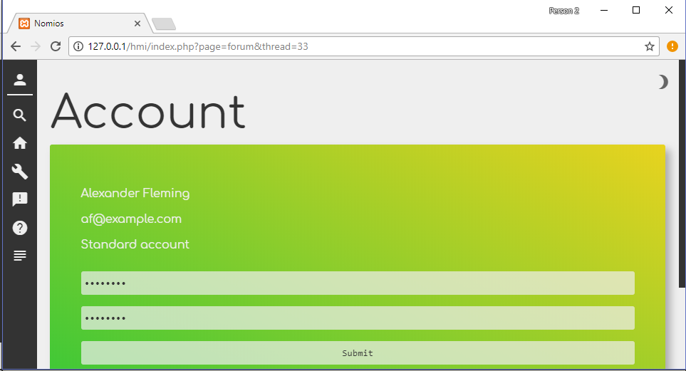
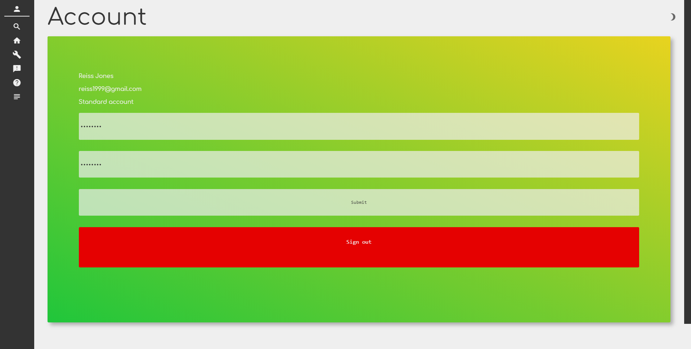
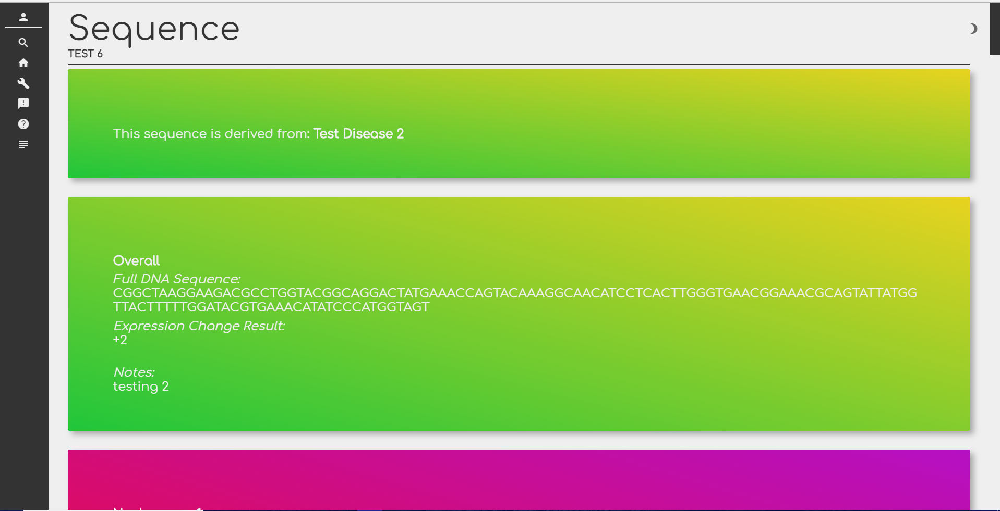
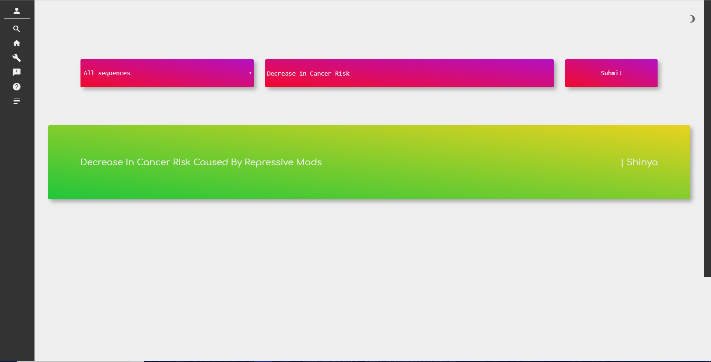

# Nomios - Test Results

The following table holds the result, the evidence of a result and a short explanation as to what it shows. Each row relates to a test and its expected result as shown in the *Test Plan*. This relation is made by the hexadecimal *Reference Number*.

| Reference Number | Evidence                                                     | Explanation                                                  |
| ---------------- | ------------------------------------------------------------ | ------------------------------------------------------------ |
| 0                |                                     | The thread has been **successfully posted**. This is proved as it is displayed on the forum page, therefore it has been submitted to the *thread* table. |
| 1                |                                     | The message has been **successfully posted**. This is proved as it is displayed on the thread page, nested "within" the original post, therefore it has been submitted to the *messages* table. |
| 2                |                                     | The reply has been **successfully posted**. This is proved as it is displayed on the thread page, nested "within" the message, therefore it has been submitted to the *replies* table. |
| 3                |            | We are viewing this thread as the user *Shinya* and the original post is displayed therefore this test is **successful** - users can viewing original posts created by other users in a thread. |
| 4                |            | We are viewing this thread as the user *Alexander* and this user has posted a message in response to the original post, therefore a row has been added to the *messages* table. Therefore this test was **successful** as users who did not start the thread can post responses to it. |
| 5                |        | The *John* user attempted to post a message that contains the *

* HTML tags that contains CSS code that would turn containing text black. They were **successfully** filtered out of the message as the message text is not black. This means malicious users can not use a XSS attack. |
| 6                |        | The reply is no longer displayed. This means that it must have been deleted from the *replies* table. This test was therefore **successful** - the admin can delete replies successfully. |
| 7                |                                   | The *Shinya* account is a standard account (i.e. has no admin privileges). As we can see there is no form for deleting a thread. Therefore, the account cannot delete threads, messages or replies. Therefore the test was a success. |
| 8                |        | The *Shinya* account has posted a thread that contains artificial mark up. Its result is displayed first with the text that is stored in the database, second. This shows that the artificial mark up is translated to HTML mark up. Therefore the test was a success. |
| 9                |                                   | The HTML and CSS is displayed as intended. The help menu is clearly visible. Therefore the test was a success as the HTML and CSS code was correctly interpreted. |
| A                |  | The first screenshot shows an account being created. The second shows the same account being activated. The third shows that the user has logged into this account. This progression shows an account creation. Therefore, the test was successful. |
| B                |        | The first screenshot shows that the user cannot enter the forum (shown by the cursor image when hovered over the forum icon). The second shows that no HTML is displayed in the forum and tool pages. Therefore the user cannot submit any HTML forms. The test was successful. |
| C                |        | The first screenshot shows the HTML form the user has filled. The second shows the record that has been created in the *diseases* table after the form was submitted. Therefore, the test was successful. |
| D                |  | The first screenshot shows us that the nucleosome sequence has been submitted. The second shows that a new record in the *nucleosomesequences* table has been made. The final screenshot shows that new records in the *nucleosomes* table have been made. Some *nucleosomednasequences* records may have been created or reused. Thus the test was successful. |
| E                |        | The first screenshot shows the edit form being used to change the disease that the sequence is currently associated with to a different one. The second screenshot shows that the edit was successful as the sequence now displays the name of this other disease. |
| F                |        | For this test I logged into another account (*John*)The first screenshot shows a new sequence being created and associated with the "Cancer Risks" disease - the same as the previous test. The second screenshot shows both within the same disease page. Both sequences can be seen within the page as HTML blocks. Therefore the test was a success. |
| 11               |      | The first screenshot shows the edit HTML form that creates a new nucleosome. It contains a DNA sequence and some histone modifications. The second screenshot shows the result after submission. The nucleosome has been created using the inputted data.  Therefore a new record was added to the *nucleosome* table. The test was successful. |
| 12               |  | The first screenshot shows the original DNA sequence and histone modifications for Nucleosome 6. The second shows the new data before submitting the edit form. The third shows Nucleosome 6 having the new data instead of the old. Thus this *nucleosome* record has been updated. The test was successful. |
| 13               |  | The first screenshot shows a nucleosome before the delete from is submitted (i.e. the delete button). The second shows no sign of this nucleosome after the form was submitted. Therefore the record was deleted from the *nucleosome* table. The third screenshot shows a nucleosome sequence before the delete form is submitted. The final screenshot shows what happens after submission. The *nucleosomesequence* record was removed. Thus this was a successful test. |
| 14               |                                  | This nucleosome sequence was created by another user. No edit form is displayed. therefore the user cannot perform the same previous three tests on the sequence. the test is therefore successful. |
| 15               |  | The first screenshot shows the current *notes* of a sequence owned by the user. The second shows the edit HTML form with the new data. The third shows the change of the *notes* for this sequence. The fourth screenshot shows the current *notes* for a disease at the top of the screenshot, with the new data in the edit form at the bottom. The last screenshot shows that the disease's *notes* has changed to contain the new data. Therefore the test was successful. |
| 16               |                                  | This screenshot shows a description of the effect of the histone modification sequence in this nucleosome sequence. A positive result is had. Therefore the test was successful. This is evidence for the histone modification interpreter being accurate. |
| 17               |                                  | This screenshot shows a result to be negative. This is the expected result. Therefore the test is successful. This is evidence for the histone modification interpreter being accurate. |
| 18               |                                  | This screenshot shows the change in expression being positive. This shows an increase in expression. Therefore, the test was successful. This is evidence for the histone modification interpreter being accurate. |
| 19               |      | Notice that these screenshots show the search type as "My * " where * is "sequences" and "diseases" respectively. This means only records associated with the user are being searched through. The first screenshot shows the user searching for a particular sequence. It is found. The second shows the user finding a particular disease - it is a;so found. Both are displayed. the test was a success. The search result is accurate, particularly as the entire *name* of the sequence/disease was not fully inputted. Meaning that specific search results are returned with a smaller character count and are therefore, more efficient. |
| 1A               |      | Notice that these screenshots show the search type as "All * " where * is "sequences" and "diseases" respectively. This means all records are being searched through. The firsts screenshot shows that the specified sequence is returned and displayed. The second shows the same but with a disease *name*. Thus, the test is successful. The search result is accurate, particularly as the entire *name* of the sequence/disease was not fully inputted. Meaning that specific search results are returned with a smaller character count and are therefore, more efficient. |
| 1B               |  | The "Test Message" message no longer appears after the "Delete" button is clicked. This must mean that it was removed from the *messages* table. There are no replies too, which (as this was the only thread in the database) means that the associated rows in the *replies* table were removed too. This test was therefore **successful** - the admin can delete messages and their associated replies. |
| 1C               |  | The "Hey guys!" thread is no longer displayed after the "Delete" button is clicked. It must have been removed from the *thread* table. The associated messages and replies have been removed too. This test was therefore **successful** - the user can delete threads and associated messages and replies. |

I used three accounts for this testing. This was to perform some of the tests that required it, but also to make my tests more reliable, as the wider range of accounts I use for testing will confirm that the tests work on multiple accounts - particularly as I repeated each of those tests on each account and the result of each test could be seen by each account, proving that different users can communicate and collaborate using *Nomios*. In case the user wished to use *Nomios* using these test accounts I have provided the necessary details to sign in using those accounts:

| Email Address  | Password |
| -------------- | -------- |
| sy@example.com | shinya33 |
| jg@example.com | john62   |
| af@example.com | alex81   |
| ma@admin.com   | admin99  |

*Note that ma@admin.com is an admin account.*